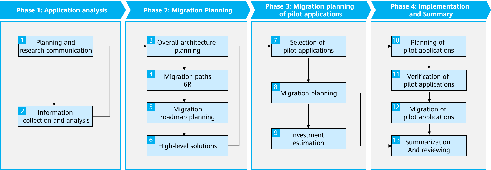
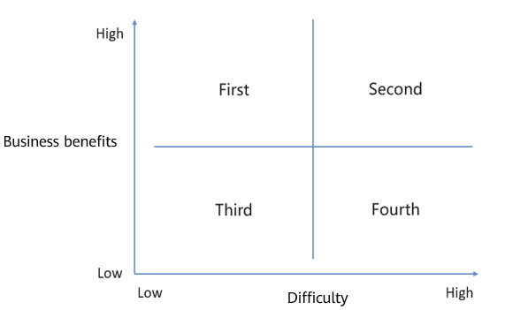
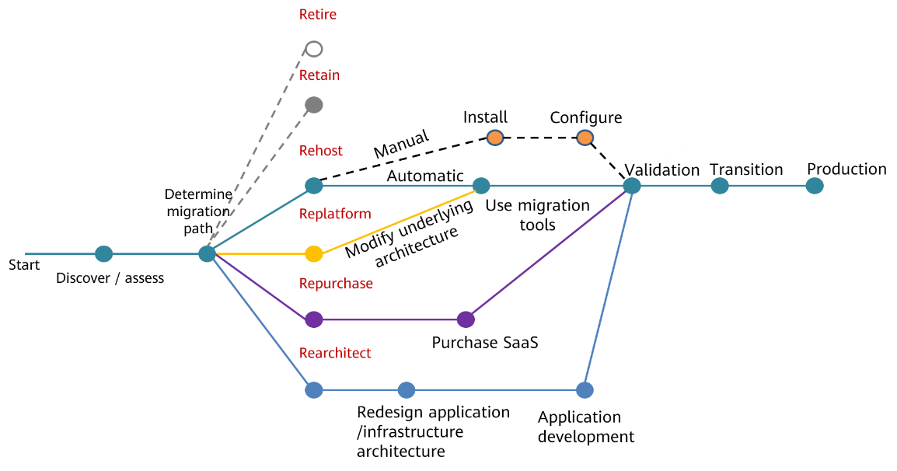

Application Migration
---------------------

Based on T-Systems' successful practices and experience in serving a large
number of customers, Open Telekom Cloud had identified four main phases in the
migration process. An understanding of these four phases makes it easier
to ensure a smooth migration.

Phase 1: Application analysis
******************************

The services and functions provided
need to be clearly identified, along with the technology stacks,
deployment modes, SLAs, and dependencies. You need to know where the
applications come from and how the O&M is handled.

The research includes, but is not limited to:

-  Application architectures
-  Application modules, internal and external dependencies, and the
   languages and frameworks used
-  Application hosts, including host configurations, specifications,
   operating systems, total data volume, NICs, HA deployment, as well as
   DR and backup requirements
-  Databases, including the types and versions, how much data needs to
   be handled, and the performance and HA requirements
-  Middleware, including the types (such as message middleware and cache
   database), versions, as well as cluster scale and capacity

Phase 2: Migration planning
***************************

Based on the information collected in
Phase 1, assess applications using the **6R model** (Rehost, Replatform,
Refactor/Rearchitect, Repurchase, Retire, and Retain) and following
the general principles described here. Analyze application readiness
and benefits and identify proper migration paths.

-  General principles for migrating applications to the cloud
-  For third-party SaaS services, as long as they can keep up with
   service development, keep them unchanged.

-  For purchased software deployed on hosts, rehost or replatform them
   to migrate them to the cloud.

-  For applications that are not ready for cloud, for example,
   applications with incompatible host OSs, applications with
   outdated, unavailable, or unsupported components, or applications
   whose benefits from migration seem elusive, keep these
   applications on premises.

-  For self-developed applications, rehost, replatform, or rearchitect
   them, depending on the technical stack requirements of customers.

-  For components such as databases and middleware, if there are
   available cloud services, replatform them, use pay-per-use billing
   for the best cost-effectiveness, and so you don't have to worry
   about the O&M.

-  Principles for prioritizing applications for migration

Prioritize applications to be migrated based on the expected benefits
and on their readiness. Migrate applications in the order shown in the
following figure. Start with those that are easy to migrate and can
benefit much from migration, and give low priority to applications that
are more difficult or that will benefit little.

Business Benefits Considerations
~~~~~~~~~~~~~~~~~~~~~~~~~~~~~~~

Considerations for business benefits include but not limited to:

-  Improving performance, increasing efficiency, and reducing costs
-  Changing service requirements
-  Enhancing user experience
-  Serious architecture issues
-  Auto scaling requirements
-  Compliance

Cloud Readiness Considerations
~~~~~~~~~~~~~~~~~~~~~~~~~~~~~~

Considerations for cloud readiness include but are not limited to:

-  Service complexity
-  Maturity of business and IT design
-  Dependency
-  Organizations and capabilities

Phase 3: Migration planning of pilot applications
*************************************************

Select pilot
applications based on the overall migration path planned for your
applications, plan the migration of the pilot applications, and
estimate the costs involved. Proper planning streamlines the
architecture and helps ensure a successful experience, which, in
turn, supports future migrations.

Phase 4: Implementation and summary
***********************************

After developing the migration
plan and getting budget approved, migrate the pilot applications to
identify what the company should focus on in terms of technology,
organization, process, talent, and cost. This phase is critical to
accumulating practical experience. This phase helps companies more
confidently migrate applications to the cloud and benefit more from
the migration.

When using the 6R methodology, the migration paths are as follows:

The following section covers the Rehost, Replatform, and Rearchitect
migration paths.

.. toctree::
   :maxdepth: 1

   rehost.rst
   replatform.rst
   rearchitect.rst
   migration.rst