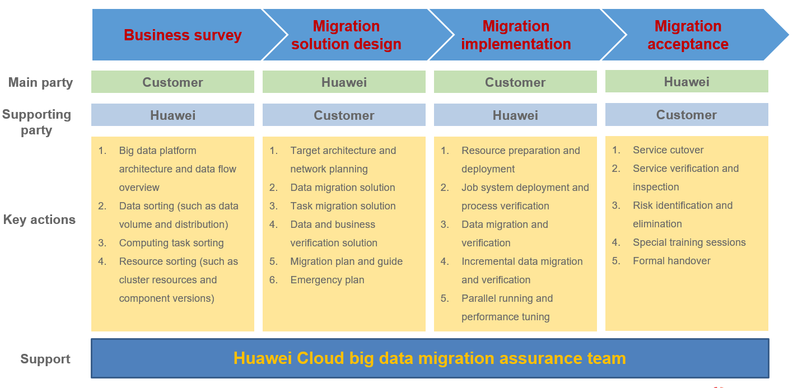
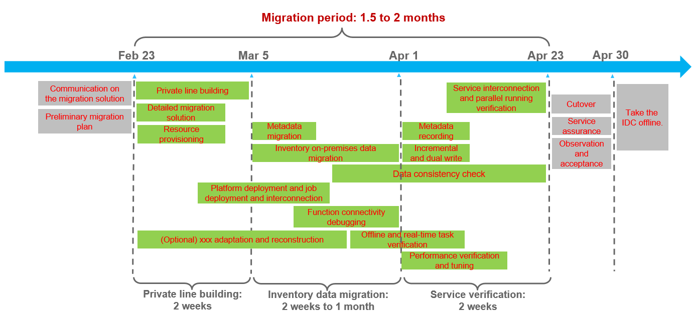
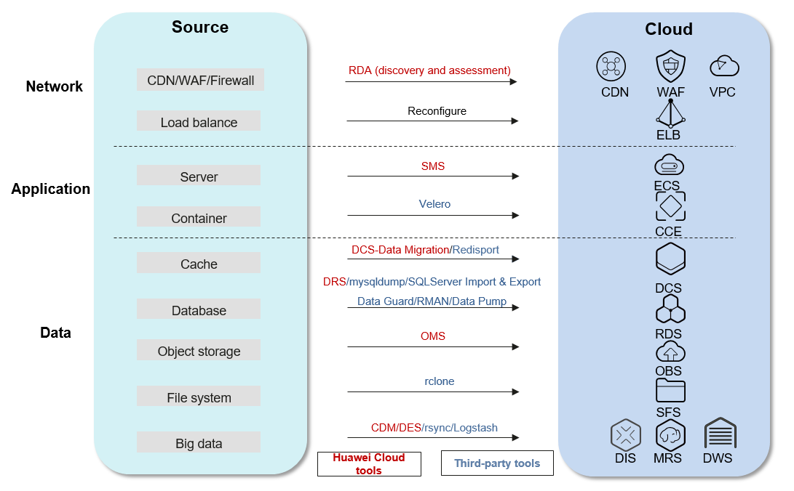
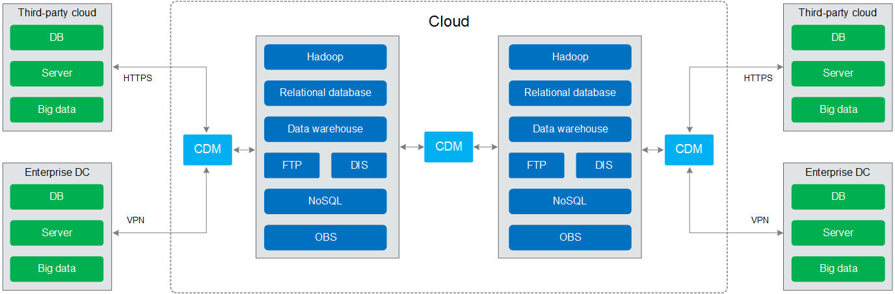

Big Data Migration
~~~~~~~~~~~~~~~~~~

Big data migration is a part of data migration and complies with the
cloud migration theory and project management logic. In terms of project
management, a big data migration plan contains **four phases**:

-  Business survey
-  Migration solution design
-  Migration implementation
-  Migration assurance

Migration Plan Design
^^^^^^^^^^^^^^^^^^^^^^^^^

In the **business survey phase**, the customer is the main party, and
T-Systems is the supporting party. They should work together to conduct the
survey and determine the customer's business status, including:

-  Customer's big data platform and services
-  Physical deployment and data flows of the customer's big data
   platform
-  Big data assets, including resources, data, and permission
   configurations

In the **migration solution design phase**, T-Systems is the main party,
and the customer is the supporting party. They should work together to
design the migration solution and determine the migration content,
including:

-  The reconstruction and optimization needed to adapt to the
   destination platform and how to ensure a smooth migration
-  Whether to perform migration in different phases and the objectives
   for each phase
-  Cloud services involved in a platform migration
-  Volume of the data to be migrated and the migration method to be used
-  The customer's task scheduling system is the core for task migration
-  The traffic switchover solution involves real-time data flows and
   basic service capabilities such as Nginx and ELB.
-  How to ensure a successful rollback

In addition, required cloud resources should be planned and evaluated,
including:

-  Platform building resources
-  Migration network bandwidth. This is closely related to the entire
   cloud migration solution and involves cost estimation. In addition,
   the networking on the cloud should also be planned, including how to
   enable network connectivity and protect network security.

In the **migration implementation phase**, the customer is the main
party in resource preparation and deployment, job system deployment and
process verification, data migration and verification, incremental data
migration and verification, parallel running, and performance tuning.

The **migration acceptance phase** covers service cutover, verification,
and inspection, risk identification and handling, special training and
enablement, and formal handover.

Example Migration Plan and Period
^^^^^^^^^^^^^^^^^^^^^^^^^^^^^^^^^

The migration plan and period vary depending on the data volume, number
of tasks, components used, scheduling system, private line bandwidth,
and time period when data can be migrated.

The following figure shows an example migration plan and period for a
medium-sized customer (data volume: x PB; computing resources: x
thousand cores).

Big Data Migration Tools
^^^^^^^^^^^^^^^^^^^^^^^^

Open Telekom Cloud provides various migration tools for customers to choose
based on the scenario, data source, data volume, and requirements for
applications' responses to data. Customers can also choose open-source
or third-party migration tools.

Open Telekom Cloud provides the following big data migration tools:

CDM
***

CDM is an efficient and easy-to-use batch data migration service. It
provides easy-to-use migration capabilities and can integrate a wide
range of data sources into the data lake, reducing the data migration
and integration complexity and improving the efficiency. For details,
visit https://www.huaweicloud.com/intl/en-us/product/cdm.html.

Kafka MirrorMaker
*****************

It forwards streaming data to MRS-Kafka on Open Telekom Cloud in real time. It
is applicable to sequential messages as the consumer group has strict
requirements on the message sequence.

Generally, the MirrorMaker process needs to be started on the
destination. The metadata of the source and destination Kafka clusters
must be the same and manually configured.

DRS
***

DRS aims to enable database migration to the cloud without downtime. It
supports migration between homogeneous, heterogeneous, distributed, and
sharded databases. It also enables data integration and transmission
from databases to databases, data warehouses, and big data clusters in
seconds, laying a solid foundation for enterprise digital
transformation. For details, visit
https://www.huaweicloud.com/intl/en-us/product/drs.html.

OMS
***

OMS helps you migrate data from the object storage on other clouds to
OBS on Open Telekom Cloud.

OMS applies to the following scenarios:

-  Object migration: When you migrate typical web applications to Open Telekom
   Cloud, OMS helps you easily migrate objects to OBS buckets on Open Telekom
   Cloud.

-  Cloud disaster recovery: OMS allows you to replicate your objects to
   OBS buckets on Open Telekom Cloud for disaster recovery and backup.

-  Object restoration: OMS allows you to use data backups from other
   cloud service providers to quickly restore data on Open Telekom Cloud.

For details, visit
https://www.huaweicloud.com/intl/en-us/product/oms.html.

.. toctree::
   :maxdepth: 1
