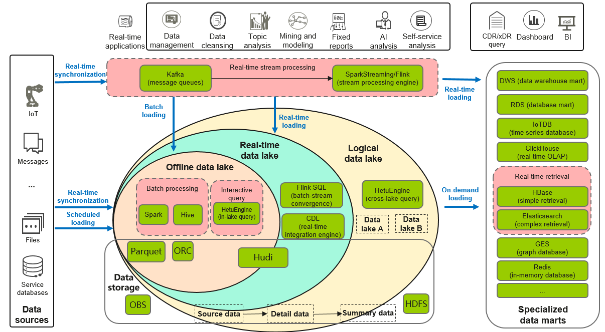
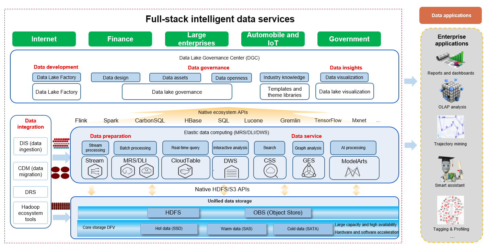

Data Management and Analytics Platform
~~~~~~~~~~~~~~~~~~~~~~~~~~~~~~~~~~~~~~

Data Lakes
^^^^^^^^^^

Data lakes are a new type of centralized repository that can store both
structured and unstructured data at any scale and does not require data
to be structured first.

First-generation data lakes use the distributed architecture of the
open-source Apache Hadoop ecosystem. They use common hardware in local
data centers to allocate and process a large amount of raw data. The
Hadoop Distributed File System (HDFS) enables customers to store data in
its native form. Administrators of first-generation data lakes must keep
an eye on complex tasks such as capacity planning, resource allocation,
and performance optimization. Due to the complexity, slow valuation, and
heavy system management workloads, many local data lake projects failed
to meet expectations.

Next-Generation Data Lakes
^^^^^^^^^^^^^^^^^^^^^^^^^^

Next-generation data lakes are based on cloud object-based storage. The
cloud provides diverse high-performance, scalable, and reliable
analytics engines and huge economies of scale, making data lakes more
cost-effective and scalable.

Huawei Cloud's next-generation data lakes are built on Object Storage
Service (OBS) and feature storage-compute decoupling. This means that
compute and storage resources can be scaled separately, preventing
unbalanced allocation of computing and storage resources on a single
node.

A data lake is a big data platform that converges data sources in
various formats within an enterprise. It provides data and compute power
through strict data permissions and resource control. A data lake is big
with multiple small marts. The most notable characteristic of a data
lake is that one piece of data can be analyzed in multiple ways.

The evolution of data lakes is divided into three phases:

-  Offline data lake: Data is imported to the data lake more than 15
   minutes after the data is generated.

-  Real-time data lake: Data is imported to the data lake in real time
   (usually in less than one minute) or quasi real time (1 minutes to 15
   minutes) after the data is generated.

-  Logical data lake: Data is integrated into a virtual data lake formed
   by multiple physically isolated data platforms.

Specialized data marts store data in specific formats for query and
analysis in specific scenarios. They are an important supplement to a
data lake. Customers may choose different data marts to meet their
varied data analysis requirements. For example, customers who have
ultra-high performance requirements may choose real-time OLAP or
in-memory databases, and those who prioritize their existing
applications' requirements may choose search databases.

If customer data is used only for query and analysis of certain types,
specialized data marts do not depend on a data lake. However, such cases
are rare now, and specialized data marts are usually used together with
a data lake.

Apart from the basic characteristics of data warehouses, data warehouse
marts have the following characteristics:

-  They are small and flexible, and can be organized in various ways,
   such as by application, department, or region.
-  Development is generally defined, designed, implemented, managed, and
   maintained by business departments.
-  They can be implemented quickly at a low cost. Investment can be paid
   back in a short period of time.
-  They integrate a wide range of tools.

To reduce costs, it is recommended that the source data and detail data
be stored in OBS and that the summary data be stored in GaussDB(DWS).

Specialized data marts are classified into real-time and offline marts
based on application scenarios. Real-time marts are used together with
Kafka and Flink. A typical case in point is the mart for querying bank
transactions.

Huawei Cloud FusionInsight Intelligent Data Lake
^^^^^^^^^^^^^^^^^^^^^^^^^^^^^^^^^^^^^^^^^^^^^^^^

This next-generation data lake takes full advantage of cloud-native
advantages, such as fast deployment, auto scaling, almost infinite
scalability, cost-effective storage-compute decoupling, and Serverless
data analytics services. It aims to provide enterprises with a highly
scalable, available, and intelligent next-generation data lake
ecosystem, helping enterprises reduce O&M time and costs, and allowing
them to devote more resources to data analysis and business.

FusionInsight provides extensive analytics services that adapt to all
types of data analysis scenarios and enable organizations of all sizes
and industries to reshape their business. Huawei Cloud provides
cost-effective and scalable dedicated services throughout data
collection, data management, data storage, data analysis, log analysis,
stream analysis, and machine learning (ML).

-  First of all, if you want to use a big data platform for data
   processing, you must integrate your data into the big data platform.
   You can use different data integration tools based on the data type.
   For example, you can use Data Ingestion Service (DIS) to import data
   in real time, use Cloud Data Migration (CDM) to move massive amounts
   of on-premises data to Huawei Cloud, and use Data Replication Service
   (DRS) to migrate databases.

DIS enables you to easily collect, process, and distribute real-time
streaming data so that you can quickly respond to new information. DIS
can be interconnected with a wide range of third-party data collection
tools and provides various cloud service connectors, agents, and SDKs.
DIS is applicable to scenarios such as device monitoring, real-time
recommendations, and log analysis in industries such as IoT, Internet,
and media. For details, visit
https://www.huaweicloud.com/intl/en-us/product/dis.html.

For details about CDM and DRS, see section "‎4.2.4.4 Big Data Migration
Tools".

-  It is recommended that you store the data migrated to the cloud in
   OBS. If the data is small in size and needs to be processed in a
   timely manner, you can also store it in HDFS.

OBS is an object-based storage service that provides secure, reliable,
and low-cost data storage with an unlimited capacity. OBS provides
various storage types to meet customer requirements. For details, visit
https://www.huaweicloud.com/intl/en-us/product/obs.html.

-  As for data computing, we provide different components for different
   scenarios. You can use Cloud Stream Service (CS) for stream
   processing, MapReduce Service (MRS) or Data Lake Insight (DLI) for
   offline batch processing, CloudTable for real-time query,
   GaussDB(DWS) for interactive analysis or BI analysis, and Cloud
   Search Service (CSS) for search.

MRS provides high-performance big data components of the Hadoop
ecosystem, such as Hudi, ClickHouse, Spark, Flink, Kafka, and HBase, and
supports data lakes, data warehouses, BI, and AI convergence. MRS is
available in both the hybrid cloud and public cloud. In the hybrid
cloud, MRS provides offline, real-time, and logical data lakes in a
cloud-native architecture to facilitate your intelligent upgrade. In the
public cloud, MRS helps you quickly build a cost-effective, flexible,
open, and reliable one-stop big data platform. For details, visit
https://www.huaweicloud.com/intl/en-us/product/mrs.html.

GaussDB(DWS) is a fully-managed and enterprise-class cloud data
warehouse service. It is O&M-free and compatible with the PostgreSQL
ecosystem, and supports online cluster scale-out and efficient loading
of multiple data sources. It helps enterprises efficiently and
cost-effectively analyze massive amounts of data online and quickly
monetize data. For details, visit
https://www.huaweicloud.com/intl/en-us/product/dws.html.

DLI is a Serverless data processing and analysis service fully
compatible with Apache Spark, Apache Flink, and openLooKeng (based on
Presto) ecosystems. Enterprises can use standard SQL, Spark, and Flink
programs to jointly compute and analyze multiple data sources and
explore their value. For details, visit
https://www.huaweicloud.com/intl/en-us/product/dli.html.

CSS is an online distributed search service powered by the open-source
Elasticsearch. It provides multi-condition search, statistics, and
reports for structured and unstructured text, and is compatible with
native APIs of Elasticsearch. With CSS, you can build search boxes for
websites and apps to improve document and video search experience. You
can also build a platform to monitor and analyze O&M logs and analyze
operational data. For details, visit
https://www.huaweicloud.com/intl/en-us/product/css.html.

-  We also offer Data Lake Governance Center (DGC), a big data
   application development and operations platform. On this platform,
   you can perform tasks such as data modeling, script development, job
   scheduling, data presentation, and O&M and monitoring. DGC makes it
   much easier to use big data and build a big data processing center.
   Only operated data delivers value and raises revenue. For details,
   visit https://www.huaweicloud.com/intl/en-us/product/dayu.html.

Big data analysis results can be used for enterprise management,
including report analysis, OLAP analysis, track mining, and user
tagging, helping enterprises make informed business decisions.

.. toctree::
   :maxdepth: 1
