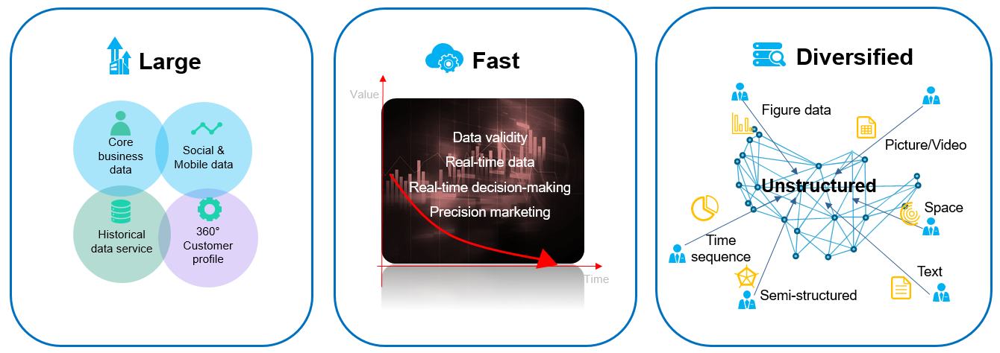

Data Migration
--------------

With the expansion of the mobile Internet has come explosive growth in
data. Data forms and data processing requirements have also undergone
profound changes. In addition, application silos and data silos have
become the biggest obstacles to enterprises' digital transformation. The
main reasons for data silos include:

-  The information channels of different departments generate different
   data storage formats.
-  Departments define data based on their own business. As a result,
   there is no standardized definition of data and the same data may be
   given different meanings.

In data governance, we may face challenges such as scattered resources,
data unavailability, and siloed applications.

The following are the most urgent issues that enterprises need to
address:

-  Quickly integrating new and historical data to avoid information
   silos
-  Processing and analyzing various types of data with different value
   densities in a cost-effective, efficient, and real-time manner to
   meet business requirements
-  Turning data into assets and paving the way for data-driven
   innovation to stimulate business growth

.. toctree::
   :maxdepth: 1

   data-management-and-analytics-platform.rst
   typical-data-lake.rst
   big-data-migration.rst

