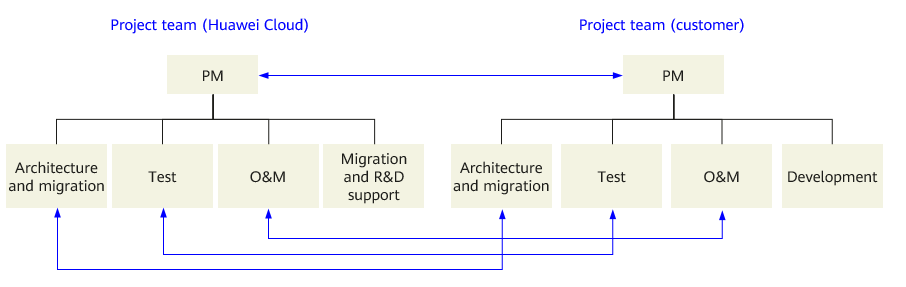

Migration Implementation
~~~~~~~~~~~~~~~~~~~~~~~~

Migration Team Establishment
^^^^^^^^^^^^^^^^^^^^^^^^^^^^

A large-scale migration project usually involves migration of a large
number of applications in a short period of time and complex
cross-application troubleshooting. The project management offices (PMOs)
will take the lead, and organize and arrange personnel from both parties
to carry out related work in an orderly and efficient manner based on
the project objectives.

T-Systems and the customer, need to set up their own project teams based on
Open Telekom Cloud's Customers Success Engineers experience in cloud migrations.
The two teams will work together during the migration.

The following figure shows the structure of the recommended migration team:

-  Project manager (PM): The PM sets up a joint project PMO to manage
   project progress, identify and manage risks and other issues, and
   promote the project within the organization.

-  Architecture and migration implementation team: The team designs
   solutions for cloud migration and cutover, manage and implement
   migration, and control technical risks during the implementation.

-  Test team: The team tests solutions and performs function,
   performance, and joint commissioning tests.

-  O&M team: The team creates, manages, and monitors cloud resources.

-  Migration and R&D support team (Open Telekom Cloud): The team processes
   escalated technical issues.

-  Development team (customer): The team is responsible for application
   development, deployment, and migration.

Migration Assurance
^^^^^^^^^^^^^^^^^^^

-  Project kick-off meeting: A formal project kick-off meeting is
   initiated to specify the project scope, objectives, delivery period,
   and responsibilities.

-  Project communication management: Regular communication is important
   between project members and project stakeholders. Communication
   exposes and helps address potential issues.

-  Project progress management: The execution of project activities and
   key tasks is monitored to ensure that the project progresses as
   planned. If there is a deviation from the schedule, corrective
   measures will be taken and reported to project members and
   stakeholders in the form of weekly or daily reports.

-  Issue and risk management: Project assumptions and risks are
   continuously monitored to quantify risks. The risk management plan
   may need to be updated at time and the implementation of risk
   mitigation measures needs to be ensured. Issues and risks are
   recorded and tracked, including details such as the issue owners and
   the times when the issues were identified. These details then need to
   be reported to project members and other stakeholders in the form of
   weekly or daily reports.

-  Delivery matrix: A joint project delivery matrix covering Open Telekom
   Cloud and the customer will be developed.

Testing and Verification
^^^^^^^^^^^^^^^^^^^^^^^^

Before services are cut over to the cloud, functional and performance
tests will be performed to verify that the applications are stable in
the cloud environment.

Service function testing
************************

The Open Telekom project personnel use the cloud resource list to make sure
all the required resources on Open Telekom Cloud are enabled. They initialize
environment configurations, deploy applications, and migrate some data
to perform joint commissioning tests. After the environment is deployed,
customers can use their own test cases to test applications and confirm
that services can run properly on the cloud.

Performance testing
*******************

Performance testing tests not just performance. There are also load
testing, pressure testing, and stability testing. Performance testing
means continuously raising the access pressure on the system (in a
system test environment, the number of concurrent requests is constantly
increasing for the test program) to obtain system performance KPIs and
maximum load-bearing capacity.

For performance testing, you can select JMeter or any other offering that
supports JMeter test projects or use third-party pressure test tools.

.. tip::

    JMeter (for simulating user traffic) and TCPCopy or GoReplay
    (for recording or copying real user traffic) can be used to perform
    pressure testing on all-link applications on the cloud to check whether
    functions and performance meet requirements.

During the test, test records and reports are generated based on the
monitoring metrics of Open Telekom Cloud monitoring systems (such as CES, AOM,
APM) and the customer's monitoring systems as well as application logs.

After the pressure test is complete, the dirty data generated during the
test is deleted, and a full and incremental data migration is performed.
After the migration is complete, at an appropriate time, service traffic
is switched over to the application on the cloud.

Service Cutover and Rollout
^^^^^^^^^^^^^^^^^^^^^^^^^^^

Service cutover and rollout are the most critical steps in a cloud
migration. Any issues in this step may lead to major faults. To ensure
smooth service cutover and rollout, a detailed pre-cutover checklist
must be formulated.

After the service cutover is complete, service running and data are
continuously monitored and observed until the services are stable on the
cloud.

After the final data synchronization is complete and dirty data
generated during testing is deleted from the target environment on
Open Telekom Cloud, service cutovers are started in off-peak hours. Generally,
service cutover can be implemented all at once, or layer by layer.

All at once
***********

For a simple or small-scale system, as long as a
full-service verification is performed first, the cutover can be
completed at a time. This kind of cutover is fast and has little
impact on ongoing services.

The one-off cutover process is as follows:

1. Stop the tests on the target and delete the test data.
2. Stop the services on the source.
3. Complete the incremental data synchronization.
4. (Optional) Configure reverse data synchronization to prepare for a rollback in case the cutover fails.
5. Modify the DNS configuration, switch the EIP, and switch traffic to the target.
6. Observe the service stability on the target.
7. Provide continuous assurance.

Layer by layer
**************

For complex services or large-scale systems, services
can be decoupled and cut over layer by layer. If there are any
problems, a rollback can be performed for an individual layer, which
reduces the risk of impacting services. However, a hierarchical
cutover like this requires multiple cutovers, which are
time-consuming and involve a heavy workload.

Layer-by-layer migration consists of two steps. First, the application
layer is cut over to Open Telekom Cloud, but with the service data still being
read from and written to on the source. After the application layer
cutover is complete, a data migration or application dual-write is
performed to synchronize service data from the source to the target on
Open Telekom Cloud in real time. After the incremental data migration is
complete, the second step, the data layer cutover, will be executed.

Layer-by-layer migration involves cross-cloud database access. The
network latency needs to be evaluated to see if it meets application
requirements.

The layer-by-layer cutover process is as follows:

Step 1: Application layer cutover
+++++++++++++++++++++++++++++++++

a. Stop the tests on the target and delete the test data.
b. Modify the configuration of the middleware layer on the target to
   point to the data layer on the source (through Direct Connect or
   VPN connections).
c. Modify the DNS configuration, switch the EIP, and switch traffic to
   the target.
d. Observe the service stability on the target.

Step 2: Database layer cutover
++++++++++++++++++++++++++++++

a. Stop the services on the target.
b. Complete the incremental data synchronization.
c. (Optional) Configure reverse data synchronization to prepare for
   rollback upon migration failure.
d. Modify the configuration of the middleware layer on the source to
   point to the data layer on the target.
e. Start services on the target.
f. Observe the service stability on the target.
g. Provide continuous assurance.

Cutover risks and service rollback
**********************************

The rollback solution in the all-at-once cutover scenario is simple.
This section describes the rollback solution in the layer-by-layer
cutover scenario.

Rollback solutions in the hierarchical cutover scenario are different
if:

The data layer has not been cut over
++++++++++++++++++++++++++++++++++++

You can directly switch the DNS to switch traffic back to the source
system.

The data layer has been cut over
++++++++++++++++++++++++++++++++

Step 1: Roll back the data layer
################################

a. Stop the services on the target.
b. Complete the reverse data synchronization.
c. Modify the configuration of the middleware layer on the target to
   point to the data layer created after the reverse synchronization on
   the source.
d. Start services on the target.
e. Observe the service stability.

Step 2: Roll back the application layer
#######################################

a. Modify the configuration of the middleware layer on the source to
   point to the data layer created after the reverse synchronization on
   the source.
b. Modify the DNS configuration, switch the EIP, and switch traffic to
   the source.
c. Start services on the source.
d. Observe the service stability.

Assurance solution for seamless DNS switchover
**********************************************

After a public domain name record is modified, it needs to be delivered
to all DNS servers around the world. Due to certain restrictions
inherent to international basic network infrastructure, the modification
takes effect within 2 hours in the Chinese mainland, but takes 48 hours
outside the Chinese mainland. During this time, the domain name may be
resolved to the original IP address, resulting in access exceptions.

If the domain name is resolved to the original IP address because the
modification to the domain name resolution record has not taken effect,
you can deploy Nginx or iptables on the source and use the Nginx HTTP
proxy or the iptables NAT to forward traffic to Open Telekom Cloud, achieving
seamless switchover of domain name records.

The following uses Nginx HTTP proxy as an example to describe the
procedure for configuring traffic forwarding:

1. Before the switchover, deploy an Nginx reverse proxy server at the
   back of the load balancer on the source to forward traffic to Open Telekom
   Cloud ELB.
2. After the domain name is switched, bind the source domain name and IP
   address to the load balancer.
3. The load balancer forwards the traffic to the backend Nginx server.
   The backend Nginx server forward the traffic to the EIP of Open Telekom
   Cloud ELB load balancer over the public network.
4. (Optional) Deploy traffic monitoring software (for example, ntop) on
   the source Nginx server and view Nginx access logs. If no traffic is
   generated and access logs are not updated, DNS resolution has been
   switched over to Open Telekom Cloud.
5. Delete the load balancer and Nginx proxy server deployed on the
   source.

.. toctree::
   :maxdepth: 1
