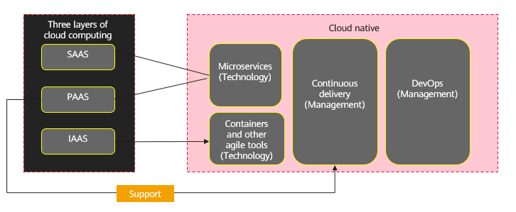
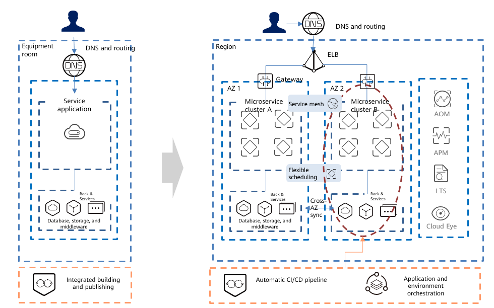

Rearchitect
~~~~~~~~~~~

Rearchitecting, also called "application refactoring", involves
re-imagining how an application is designed and developed, typically
using cloud-native features, such as transitioning from monolith to
microservices. This is typically driven by a strong need to add
features, scale, or performance that would otherwise be difficult to
achieve in the application's existing environment. This strategy tends
to be the most expensive, but will better meet future expansion
requirements in the long run. Splitting monolithic applications into
microservice requires in-depth involvement of business personnel.

Traditional Application Architecture Issues
^^^^^^^^^^^^^^^^^^^^^^^^^^^^^^^^^^^^^^^^^^^

Common issues of traditional monolithic applications include but are not
limited to:

-  Low resource utilization, and complex deployment and O&M
-  Coarse system granularity, complex scheduling, and poor scalability
-  A lack of systematic application standards, snowflake servers
   (servers that are fragile and hard to replicate due to environment or
   component upgrades)
-  A lack of unified or comprehensive application monitoring and O&M,
   since O&M personnel are busy in maintaining the underlying
   infrastructure
-  Complex application architecture
-  Too many functional modules, an overly complex architecture
-  Coupling between applications and states, which makes expansion
   difficult
-  Slow application iteration
-  Complex application development where developers need to keep track
   of all the details of an application architecture from service
   governance (such as rate limiting, circuit breaker, and downgrade)
   and data access, to message communication
-  Command-based APIs that means developers have to focus too much on
   the small execution details
-  Manual testing that decelerates application release
-  Applications that iterate too slow, so services cannot be developed
   fast enough

Cloud-Native Application Architecture
^^^^^^^^^^^^^^^^^^^^^^^^^^^^^^^^^^^^^

As defined by Cloud Native Computing Foundation (CNCF), cloud native
technologies empower organizations build and run scalable applications
in dynamic environments like public, private, and hybrid clouds.
Containers, service meshes, microservices, immutable infrastructures,
and declarative APIs exemplify this approach.

Cloud-native application architectures involve:

Microservices
*************

In a microservice architecture, an application is broken down into
various small service components. This process simplifies the complex
application architecture.

Containers
**********

Containers facilitate the implementation of microservices and help
resolve the problem of low resource utilization.

DevOps
******

Containers enhance the efficiency of software development and system
O&M, promote the maturity and development of the DevOps system, and help
resolve problems such as long application iteration period and complex
deployment and O&M.

Application Reconstruction
^^^^^^^^^^^^^^^^^^^^^^^^^^

Application reconstruction involves microservices, containers, and
DevOps processes:

-  Microservice-based reconstruction includes but is not limited to
   analyzing the current architecture, in-depth involvement of various
   business departments, dividing microservices based on required
   capabilities, defining interfaces between services, formulating
   development specifications for microservice reconstruction, and
   managing microservices.
-  Container-based reconstruction includes but is not limited to
   determining the reconstruction scope, identifying application
   dependencies, creating container images, and orchestrating and
   managing containers.
-  DevOps-based reconstruction includes but is not limited to analyzing
   R&D process, tools, and peripheral dependencies, identifying gaps,
   selecting pilot applications, and conducting training and promotion
   of agile principles.

The following image shows a typical architecture where companies use VMs
to carry individual service applications and lack a unified service
governance tool and pipeline platform. As a result, resource utilization
is low, capacity expansion difficult, R&D inefficient, rollout slow, and
O&M expensive.

Application reconstruction can bring the following benefits:

-  Microservice-based reconstruction: Monolithic applications can be
   split into small, independent, light, and loosely coupled
   microservice clusters based on the AKF Scalability Cube model,
   front-end and back-end separation, and application and status
   separation. Service mesh technologies, such as Istio, can be used to
   manage microservices across programming languages. Applications,
   databases, and middleware are deployed in multiple AZs. Traffic is
   distributed through ELB. The underlying data and statuses are
   synchronized, and applications are deployed in active-active HA mode.
-  Container-based reconstruction: Applications are hosted in fast,
   cost-effective containers that are decoupled from the underlying
   operating systems. K8S-based CCE provides elastic scheduling for
   automatic scheduling and self-healing and elastic capacity scaling on
   demand, ensuring services run smoothly and resources are not wasted.
-  DevOps-based reconstruction: Automatic pipelines and application
   environment orchestration enable resource triggering within seconds
   and environment deployment within hours. E2E O&M includes faster
   logging, comprehensive monitoring, efficient alarming, and
   comprehensive insights in to the entire system.
-  Self-organizing teams: Small teams complete service analysis,
   development, testing, deployment, and O&M. They identify delivery
   bottlenecks, and quickly verify and optimize services using
   principles of lean production.

.. toctree::
   :maxdepth: 1
