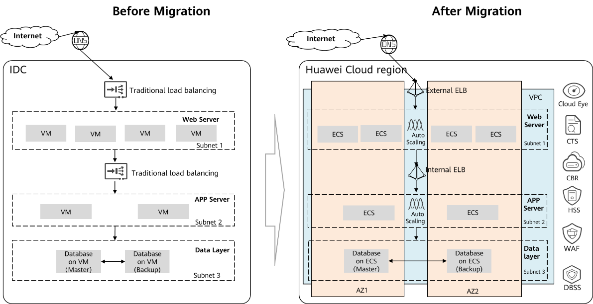

Rehost
~~~~~~

Rehost, also known as **lift and shift**, is the most common way to
migrate applications to the cloud without changing the running
environment of applications. It is usually used for Physical to Virtual
(P2V) and Virtual to Virtual (V2V) scenarios. It can help companies
quickly migrate applications such as SAP, ERP, and CRM to the cloud.

Open Telekom Cloud provides three rehosting solutions:

Application redeployment
************************

In this solution, applications can be redeployed on ECSs or BMSs. This
solution is ideal for stateless applications that do not involve data
migration. The OSs of cloud servers can be changed as needed, for
example, if an old OS is no longer supported. This solution is
recommended when a new OS is required, but this means the applications
will be offline for a time.

Image import & export
*********************

By exporting system images of source servers and then importing those
images to the cloud as private images, you can quickly create cloud
servers with the same OSs and other details as your legacy servers. This
solution is a good choice when you need to migrate on-premises servers
that do not have too much data on them. The servers will have the same
OSs before and after the migration, but there will be a fair bit of
downtime.

Server Migration Service (SMS)
******************************

SMS can migrate applications to the cloud and synchronize incremental
data to minimize the downtime. However, the OS cannot be upgraded during
the migration.

+--------------+---------------------+---------------------------------+
| Object       | Migration Method    | Pros and Cons                   |
+==============+=====================+=================================+
| Virt         | Redeployment        | -  Easy OS change               |
| ual/physical |                     |                                 |
| servers      |                     | -  Long downtime                |
+--------------+---------------------+---------------------------------+
|              | Image import &      | -  OS consistency               |
|              | export              |                                 |
|              |                     | -  Long downtime                |
+--------------+---------------------+---------------------------------+
|              | SMS                 | -  OS consistency               |
|              |                     |                                 |
|              |                     | -  Long downtime                |
+--------------+---------------------+---------------------------------+

Take a typical three-layer application architecture as an example. The
following figure shows how the architecture is different before and
after the migration.

Rehost has the following benefits:

-  The application architecture is consistent before and after the
   migration, so you know the original technology stack still work.
   Rehosting ensures the migration of your applications can go smoothly.
-  If the databases were built using Open Telekom Cloud ECS, the database
   licenses can be reused in commercial database scenarios to save
   money.
-  Applications are deployed across AZs, so you can configure DC-level
   HA.
-  With Open Telekom Cloud ELB and Auto Scaling, services can be flexibly
   scaled to adapt to workload changes.
-  ELB replaces traditional offline hardware load balancing devices and
   the network ACLs replace traditional hardware firewalls, further
   reducing the hardware investments required.
-  The O&M is simpler. CES provides comprehensive O&M monitoring of
   cloud infrastructure, and LTS provides quick collection and analysis
   of application logs.
-  The reliability is enhanced. CBR backs up cloud servers for restore
   or other server issues.
-  The security is hardened. HSS protects cloud servers, WAF filters web
   application traffic, and DBSS hardens cloud databases.

.. toctree::
   :maxdepth: 1
