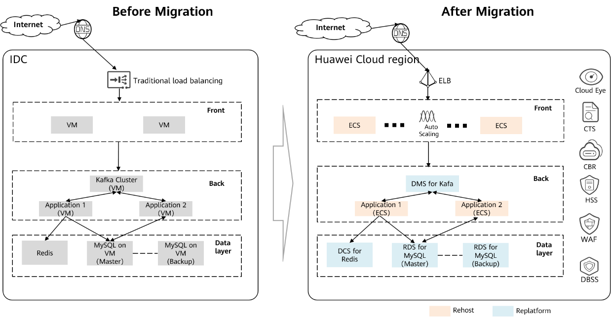

Replatform
~~~~~~~~~~

Replatforming involves upgrading an application from it's existing
legacy platform to a more modern cloud platform. It means replacing
traditional application components (such as databases and middleware)
with Open Telekom Cloud services, but without changing the core architecture
of applications.

For example, you can replace relational databases with
cloud database services from Open Telekom Cloud, replace self-built message
middleware with message queue services provided by Open Telekom Cloud, and
replace self-built cache databases with cache database services on
Open Telekom Cloud. This makes management less expensive and makes
applications more efficient and scalable.

Open Telekom Cloud provides the following solutions to migrate customers'
self-built databases and middleware or those on third-party cloud
platforms:

+------+------+-----+------------+----------------+-------------------+
| Ob   | Type | Sou | Target     | Migration      | Pros and Cons     |
| ject |      | rce |            | Method         |                   |
+======+======+=====+============+================+===================+
| Data | SQL  | S   | OTC        | Data           | The target is     |
| base | Se   | elf | Cloud RDS  | Replication    | RDS, and the      |
|      | rver | -bu | for SQL    | Service        | downtime is a few |
|      |      | ilt | Server     | (OTC Cloud)    | minutes.          |
|      |      | /DB |            |                |                   |
|      |      | aaS |            |                |                   |
+------+------+-----+------------+----------------+-------------------+
|      | M    |     | OTC        | Data           | The target is     |
|      | ySQL |     | Cloud RDS  | Replication    | RDS, and the      |
|      |      |     | for MySQL  | Service        | downtime is a few |
|      |      |     |            | (OTC Cloud)    | minutes.          |
+------+------+-----+------------+----------------+-------------------+
|      | Po   |     | OTC        | Data           | The target is     |
|      | stgr |     | Cloud RDS  | Replication    | RDS, and the      |
|      | eSQL |     | for        | Service        | downtime is a few |
|      |      |     | PostgreSQL | (OTC Cloud)    | minutes.          |
+------+------+-----+------------+----------------+-------------------+
|      | Mon  |     | OTC        | Data           | The target is     |
|      | goDB |     | Cloud      | Replication    | RDS, and the      |
|      |      |     | Document   | Service        | downtime is a few |
|      |      |     | Database   | (OTC Cloud)    | minutes.          |
|      |      |     | Service    |                |                   |
+------+------+-----+------------+----------------+-------------------+
| Mi   | R    | S   | OTC        | DCS-Migration  | The target is     |
| ddle | edis | elf | Cloud      |                | DCS.              |
| ware |      | -bu | D          |                |                   |
|      |      | ilt | istributed |                |                   |
|      |      | /Cl | Cache      |                |                   |
|      |      | oud | Service    |                |                   |
|      |      | se  | (DCS) for  |                |                   |
|      |      | rvi | Redis      |                |                   |
|      |      | ces |            |                |                   |
+------+------+-----+------------+----------------+-------------------+
|      |      | S   | OTC        | Redis-port     | Offline export    |
|      |      | elf | Cloud      |                | and import        |
|      |      | -bu | D          |                |                   |
|      |      | ilt | istributed |                |                   |
|      |      | /Cl | Cache      |                |                   |
|      |      | oud | Service    |                |                   |
|      |      | se  | for Redis  |                |                   |
|      |      | rvi |            |                |                   |
|      |      | ces |            |                |                   |
+------+------+-----+------------+----------------+-------------------+
|      | K    | S   | OTC        | MirrorMaker    | Only data in      |
|      | afka | elf | Cloud      |                | Kafka clusters    |
|      |      | -bu | D          |                | can be            |
|      |      | ilt | istributed |                | synchronized.     |
|      |      |     | Message    |                | Consumer groups   |
|      |      |     | Service    |                | or consumption    |
|      |      |     | (DMS) for  |                | progress cannot   |
|      |      |     | Kafka      |                | be synchronized.  |
+------+------+-----+------------+----------------+-------------------+

Consider the following typical architecture: A company uses Kafka
message middleware to mask performance inconsistencies between front-
and back-end applications. The applications get decoupled. They use a
Redis database cache for hot data and MySQL databases for core service
data. In a traditional IDC, the company needs to build their own
middleware and databases, implement HA deployment, backup and restore
solutions, and maintain corresponding components. Deployment can be
inefficient, O&M expensive, and capacity expansion difficult.

Open Telekom Cloud provides cloud services that let companies deploy
middleware and database components on the cloud. These services simplify
middleware and database deployment and O&M. Companies can enjoy the
following benefits:

-  Instances can be provisioned in just minutes, so they can take
   advantages of pay-per-use middleware and database services.
-  Cloud services can be deployed in HA configurations. They can deploy
   active and standby MySQL instances and Kafka/Redis clusters, and use
   cross-AZ deployment for data center-level HA.
-  There is pay-per-use cloud middleware, such as message middleware and
   cache database, and diverse instance specifications. Easy capacity
   expansion is easy so they can start small and grow big
-  They don't have to worry about O&M of middleware and databases, which
   saves money on O&M.

.. toctree::
   :maxdepth: 1
