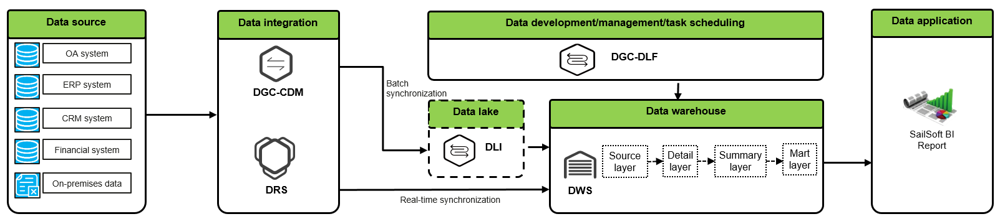
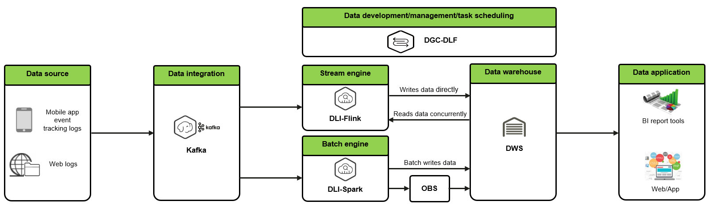
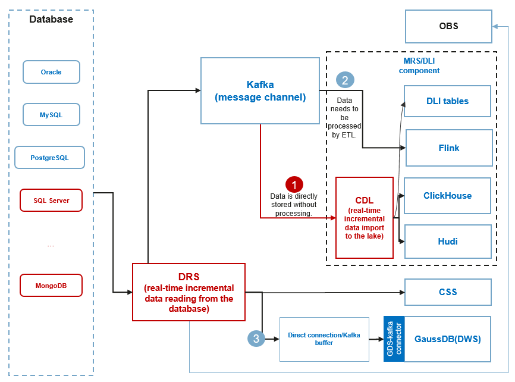
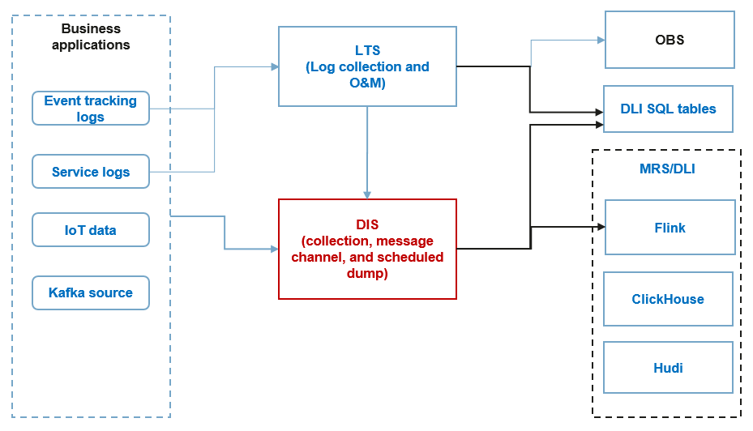

Typical Data Lake Scenarios
~~~~~~~~~~~~~~~~~~~~~~~~~~~

Data Warehouse and Report Analysis
^^^^^^^^^^^^^^^^^^^^^^^^^^^^^^^^^^

This is a traditional data warehouse mode in which a real-time data
warehouse is available and data mainly comes from databases. The data
warehouse aggregates data from different business systems (such as the
ERP, CRM, OA, and financial systems) and on-premises data centers, and
processes, governs, and gains insight into the data by layer. The data
warehouse eliminates data silos between departments, helps build a
decision-making and analytics system, and provides data for business
analysis and decision-making.

This solution mainly uses GaussDB(DWS). It has the following
characteristics:

-  One-stop big data BI platform: a comprehensive and efficient data
   collection, analysis, and BI platform that streamlines data from
   multiple business systems and provides full-stack technical
   capabilities.

-  Cost-effective data analytics foundation: Open Telekom Cloud
   high-performance GaussDB(DWS) service and data synchronization
   solution can be used to analyze massive amounts of data quickly to
   unleash data value.

-  Efficient development and simple management: DGC provides visualized,
   easy-to-use, flexible, and efficient development, management, and
   scheduling of data ETL tasks.

-  Mature and reliable BI tools: Open Telekom Cloud cooperates with top BI
   vendors to provide mature, reliable, flexible, and efficient
   visualized BI tools, making operational analysis much easier and
   accelerating value monetization.

Integrated Solution for Streaming and Batch Processing and Query
^^^^^^^^^^^^^^^^^^^^^^^^^^^^^^^^^^^^^^^^^^^^^^^^^^^^^^^^^^^^^^^^

This solution mainly applies to event tracking logs, which are commonly
used in user behavior analysis and content and product recommendations.
Event tracking logs are transferred to Flink through Kafka for real-time
processing. The dimension tables required by Flink are stored in
GaussDB(DWS) which allows millions of queries per second (QPS) for
Flink, stores the analysis results from Flink, and enables upper-layer
services to query the results.

Spark is a batch processing engine. The report data processed by Spark
is stored in GaussDB(DWS) or OBS, and read using GaussDB(DWS) foreign
tables.

This solution mainly uses GaussDB(DWS). It has the following
characteristics:

-  DLI-Flink supports stream processing and can efficiently process
   event tracking logs.

-  GaussDB(DWS) supports efficient indexing and clustering and millions
   of QPS for Flink dimension tables.

-  GaussDB(DWS) can read OBS data so that the data processed by Spark
   can be queried using GaussDB(DWS) foreign tables, avoiding redundant
   data storage.

-  GaussDB(DWS) enables query of fixed reports and self-service
   analysis, and provides high-performance, high-concurrency, and
   flexible report query capabilities.

Real-Time Import of Data from Databases to a Data Lake
^^^^^^^^^^^^^^^^^^^^^^^^^^^^^^^^^^^^^^^^^^^^^^^^^^^^^^

Incremental data in databases can be imported to the data lake in real
time.

DRS provides the CDC capability for TP/HTAP databases and can push
real-time incremental data to a standard Kafka cluster for consumption
in the data lake.

1. The built-in Kafka cluster of Change Data Lake (CDL) can directly
   connect to DRS and write data to Hudi, ClickHouse, and DLI in real
   time. By default, DRS can dump data to CSS and OBS (low priority) in
   real time for real-time search and AI training. CDL establishes a
   link to DLI. DLI and MRS share CDL's capability to import data to the
   data lake. CDL has embedded Spark scripts. You can import data directly to Hudi or
   ClickHouse without writing SQL scripts.

2. CDC imports data to the data lake through DRS and Kafka.
   DIS/DMS provides a standard Kafka message pipe for big data services
   such as MRS and DLI. DIS must support standard Kafka APIs.

3. The database CDC imports data to GaussDB(DWS) in real time through
   DRS and Kafka.

   -  Direct import: This mode applies to scenarios where less than or
      equal to 3,000 lines of data need to be synchronized per second. DRS
      parses the real-time incremental data in the source database and
      directly writes it to GaussDB(DWS).

   -  Import through a buffer: This mode applies to scenarios where more
      than 3,000 lines of data need to be synchronized per second. DRS
      obtains real-time incremental data from the source database and
      pushes the data to the backend Kafka message cluster. Then the
      built-in GDS-kafka Connector of GaussDB(DWS) writes the data to
      GaussDB(DWS) tables.

Real-Time Import of Messages and Logs to a Data Lake
^^^^^^^^^^^^^^^^^^^^^^^^^^^^^^^^^^^^^^^^^^^^^^^^^^^^

DIS allows you to build Serverless message clusters and collect and dump
data to OBS, DLI tables, and CloudTable.

LTS provides application operations and O&M capabilities, such as log
collection, query, and analysis. In addition, LTS can dump log data to
data lake components such as OBS, DIS, and DLI tables for further
analysis.

**Real-time import of streaming data such as messages to the data lake
through DIS**

-  DIS provides Serverless message clusters with message pipelines for
   dumping messages to big data cloud services such as MRS and DLI.

-  DIS can also collect and dump data to big data ecosystem services
   such as OBS, DLI, and CloudTable at scheduled time.

**Import of streaming data such as application logs to the data lake
through LTS**

LTS provides log collection and O&M functions and can dump logs to
DIS/DMS, OBS, and DLI for further analysis.

.. toctree::
   :maxdepth: 1
