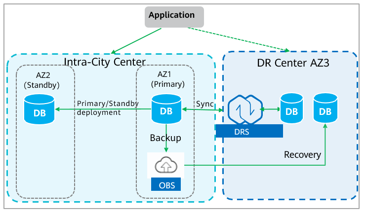

Backup and Restoration
~~~~~~~~~~~~~~~~~~~~~~

Data security is a critical concern for most enterprises today. When
migrating services to the cloud, cloud data security is a major concern.
Huawei Cloud provides a comprehensive backup and restoration system to
guarantee data security.

+------------------+---------------------------------------------------+
| Object           | Backup Policy                                     |
+==================+===================================================+
| ECS              | Cloud Backup and Recovery (CBR) uses snapshots to |
|                  | back up entire ECSs, or you can configure it to   |
|                  | back up the system disk and data disks separately |
|                  | if needed. You can configure a backup policy with |
|                  | whatever execution time and backup frequency you  |
|                  | need.                                             |
+------------------+---------------------------------------------------+
| Database         | -  After the **automated backup policy** is       |
|                  |    enabled, a full backup is automatically        |
|                  |    triggered. Then, a full backup will be         |
|                  |    performed based on the time window and backup  |
|                  |    cycle specified in the backup policy.          |
|                  |                                                   |
|                  | -  When an instance status is **backed up**, data |
|                  |    is copied from the instance, compressed, and   |
|                  |    uploaded to an OBS bucket, and stored in OBS   |
|                  |    for as long as you specified in the backup     |
|                  |    policy. Amount of time required to complete    |
|                  |    the backup depends on the amount of data to be |
|                  |    backed up.                                     |
|                  |                                                   |
|                  | -  After the automated backup policy is enabled,  |
|                  |    an **incremental backup** is automatically     |
|                  |    performed every 5 minutes to ensure data       |
|                  |    reliability.                                   |
+------------------+---------------------------------------------------+
| Key service data | You can set the backup cycle and retention period |
| (such as         | for key service data based on the **file          |
| configuration    | importance** and **change frequency**. You are    |
| files and key    | advised to back up service data to OBS buckets.   |
| documents)       |                                                   |
+------------------+---------------------------------------------------+

Cloud Server Backup and Restoration
***********************************

The following figure shows the backup capabilities provided by Huawei
Cloud CBR for ECSs, BMSs, and EVS disks.

+------------+----------------------------+---------------------------+
| Category   | Function                   | Feature                   |
+============+============================+===========================+
| Backup     | Cloud server backup        | Backs up ECSs including   |
|            |                            | their EVS disks using the |
|            |                            | snapshot technology.      |
+------------+----------------------------+---------------------------+
|            | BMS backup                 | Backs up BMSs including   |
|            |                            | their EVS disks using the |
|            |                            | snapshot technology. (The |
|            |                            | BMSs must use EVS disks.) |
+------------+----------------------------+---------------------------+
|            | Cloud disk backup          | Backs up cloud disks.     |
+------------+----------------------------+---------------------------+
| Recovery   | Cloud disk restoration     | Restores backup data to   |
|            | using backups              | specified points in time. |
+------------+----------------------------+---------------------------+
|            | Cloud server restoration   | Restores servers to       |
|            | using backups              | specified points in time. |
+------------+----------------------------+---------------------------+
|            | Cloud disk creation using  | Creates disks from        |
|            | backups                    | backups.                  |
+------------+----------------------------+---------------------------+
|            | Image creation using       | Uses backups to create    |
|            | backups                    | images and then provision |
|            |                            | ECSs.                     |
+------------+----------------------------+---------------------------+

Database Backup and Restoration
*******************************

For service scenarios that demand HA, OBS (cold standby) or DRS (hot
standby) are deployed in different AZs in the same city to establish a
remote DR center and ensure geo-redundant data security. If both AZ1 and
AZ2 fails, the DR center can still ensure data security.

If a database or table is maliciously or mistakenly deleted, the standby
database is also deleted and cannot be restored. Backups can protect you
from this sort of malicious or accidental operations.

-  Automated backup: Huawei Cloud database service creates automated
   backups for the DB instance during the backup period and saves the
   backups for a length of time determined by the configured backup
   retention period.

-  Manual backup: Manual backups of DB instances are saved based on the
   configured backup retention period. You can restore data to any point
   in time within the backup retention period if needed.

-  Full backup: The system backs up all selected data even if no changes
   were made to the data after the last backup.

-  Incremental backup: RDS automatically backs up data every 5 minutes.

Backup data restoration is implemented by restoring the data backup
files stored in OBS to databases. You can use full and incremental
backups to restore data to a required point in time. In addition, the
Huawei Cloud GaussDB-based new database architecture (such as GaussDB
for MySQL), with decoupled storage and compute, provides backup and
restoration capabilities using snapshots. The backup and restoration is
significantly faster than with traditional logical or physical backups
(see the official website for more information). These databases can
ensure zero RPO for customer databases.

Cloud Backup and Recovery (CBR) enables you to easily back up ECSs,
BMSs, EVS disks, SFS Turbo file systems, local files, and on-premises
VMware virtual environments. If there is a virus attack, accidental
deletion, or software or hardware fault, you can restore data to any
point in the past when the data was backed up. For details about CBR,
visit https://www.huaweicloud.com/intl/en-us/product/cbr.html.

.. toctree::
   :maxdepth: 1