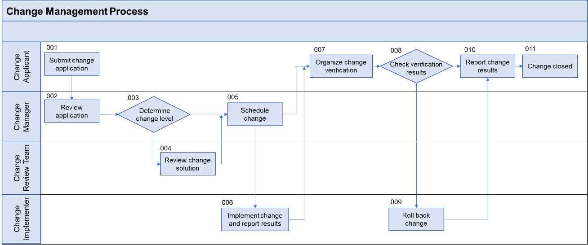

Change Management
~~~~~~~~~~~~~~~~~

Change management aims to standardize change activities (such as change
request, review, scheduling, implementation, and verification) in the
production environment. With clear requirements, make full preparation
to reduce impacts on services, ensure successful change activities and
safe, stable production environment, maximize system availability, and
meet SLAs.

Roles and Responsibilities
^^^^^^^^^^^^^^^^^^^^^^^^^^

+------------------------+---------------------------------------------+
| Role                   | Responsibility                              |
+========================+=============================================+
| Change applicant       | Submits change applications according to    |
|                        | standards, checks the submitted             |
| (Maintenance engineer) | information, verifies changes, and confirms |
|                        | results.                                    |
+------------------------+---------------------------------------------+
| Change manager         | Reviews and assigns change applications,    |
|                        | conducts communication, schedules           |
| (O&M owner)            | resources, and follows up with the change   |
|                        | implementer to track the change progress    |
|                        | and close the change applications.          |
+------------------------+---------------------------------------------+
| Change review team     | Reviews and approves common change          |
|                        | solutions.                                  |
| (O&M owner and         |                                             |
| development owner)     |                                             |
+------------------------+---------------------------------------------+
| Change implementer     | Implements changes based on approved        |
|                        | solutions.                                  |
| (Maintenance engineer) |                                             |
+------------------------+---------------------------------------------+

Change Classification
^^^^^^^^^^^^^^^^^^^^^

Emergency Changes
+++++++++++++++++

These changes are proposed when the production environment is or about
to be unavailable. There is not enough time to evaluate or approve such
changes by the usual process. For example, an emergency change is
required when there is a new version defect that directly affects user
operations.

Major Changes
+++++++++++++

These changes are made during version upgrade and O&M of the service
system. If service interruption lasts longer than 30 minutes during the
change, notify affected users in advance.

Normal Changes
++++++++++++++

These changes are made during version upgrade and O&M of the service
system. If service interruption lasts less than 30 minutes during the
change, notify affected users in advance.

Routine Changes
+++++++++++++++

These are production environment changes that are low-risk. The change
impact has been evaluated by O&M and development departments in advance,
procedures are standard, implementers have been determined, and change
effectiveness has been proven more than three times. This type of change
is performed according to standard operation guides and will not affect
services. Customers are unaware of such changes during upgrades.

Change Process
^^^^^^^^^^^^^^

An applicant submits a change application
+++++++++++++++++++++++++++++++++++++++++

There are factors to determine before the change. If any are missing,
provide reasonable explanation.

-  Reason and purpose: Explain why the change is required and what the
   change will do. If necessary, provide outline proof that the change
   is feasible.

-  Risks: Describe the potential problems brought about by the change
   and how to avoid them. Assess both current and related systems and
   domains for risks.

-  Impact: Describe how the change will affect customers and other
   domains.

-  Test report: If a test was previously conducted, attach its report to
   the application.

The change guide should detail the backup, implementation, rollback, and
verification schemes. If the change requires special implementation
times, the applicant should specify them in the application.

The change manager reviews the application
++++++++++++++++++++++++++++++++++++++++++

This review includes the change time window, plan, and type.

-  Check that the change time fits the overall planning. If not, advise
   the applicant to postpone the change or assist them in initiating the
   emergency change process.

-  Check that the change type (emergency, major, or normal) is
   reasonable and the change level is valid.

-  Determine whether the implementation time is reasonable, and tell the
   applicant to adjust it if necessary.

The change review team reviews the change solution
++++++++++++++++++++++++++++++++++++++++++++++++++

-  Check that the reason and purpose of the change are clear.

-  Check that the risks and measures are clear.

-  Check that the impact of the change is clear. For example, how users
   and the production environment will be affected during a specific
   period.

-  Check that the implementation process is valid, the procedure is
   reasonable and clear, and the purpose is achievable.

-  Determine whether a test report is required for the change. If so,
   check for an attached test report.

-  Check for any temporary backup, rollback, and verification before the
   change.

-  **The change manager schedules the change.**

-  Check for any conflicts with other changes in time, content, and
   components, and assist the applicant in checking whether the change
   affects routine operations, shutdown, and backup.

-  Approve the change.

The change implementer implements the change
++++++++++++++++++++++++++++++++++++++++++++

-  Wait for approval before proceeding.

-  Use the approved solution for the change.

-  If an unexpected service degradation, interruption, or data loss
   occurs during implementation, contact the change manager. Record and
   handle the exception.

-  After implementing and verifying the change, report the actual
   results and time taken.

The change applicant verifies the change
+++++++++++++++++++++++++++++++++++++++

-  Verify the change according to the plan and check whether the purpose
   has been achieved. If it has not, report this to the change
   implementer.

-  Complete the verification report.

-  If an unexpected service degradation, interruption, or data loss
   occurs during verification, ask the change manager how to handle the
   exception. Record the exception.

The change implementer rolls back the change
++++++++++++++++++++++++++++++++++++++++++++

-  If the change result does not meet expectations, roll back the change
   as planned. If services cannot be recovered within the expected time
   window, escalate the problem by following the incident management
   process.

-  If the change passes the verification or cannot be verified in the
   time window, and needs a rollback, submit an application.

The applicant reports the change results
++++++++++++++++++++++++++++++++++++++++

-  Report the results promptly (ideally within two working days) after
   the change is completed.

-  Close the work order if the change is successful.

-  If the change fails, analyze why and provide the causes and
   improvement measures.

KPIs
^^^^

Change success rate
+++++++++++++++++++

The percentage of changes in a month that were successful. Only changes
whose status is Successful when closed count.

Formula: (Number of successful changes/Total number of changes) x 100%

Service interruptions
+++++++++++++++++++++

The number of service interruptions caused by changes in a month.

Formula: Number of service interruptions caused by all changes in a
month

Service interruption change rate
++++++++++++++++++++++++++++++++

The percentage of changes in a month that interrupted services.

Formula: (Number of service interruption changes/Total number of
changes) x 100%

Emergency change rate
+++++++++++++++++++++

The percentage of changes in a month that were emergencies.

Formula: (Number of emergency changes/Total number of changes) x 100%

.. toctree::
   :maxdepth: 1