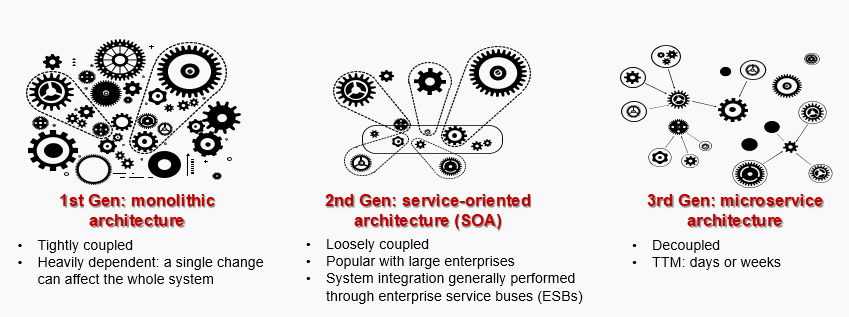
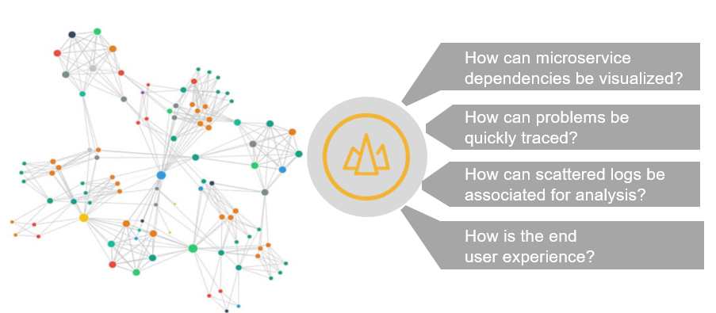
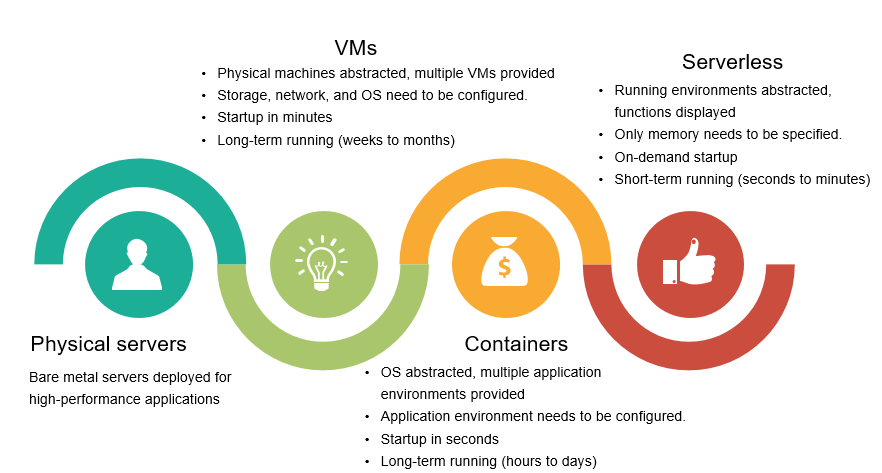
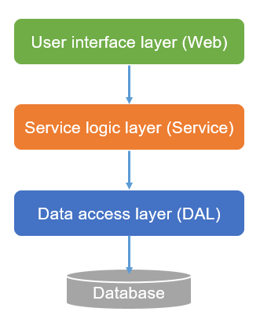
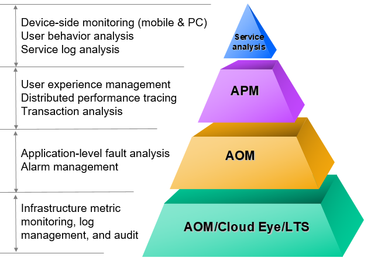
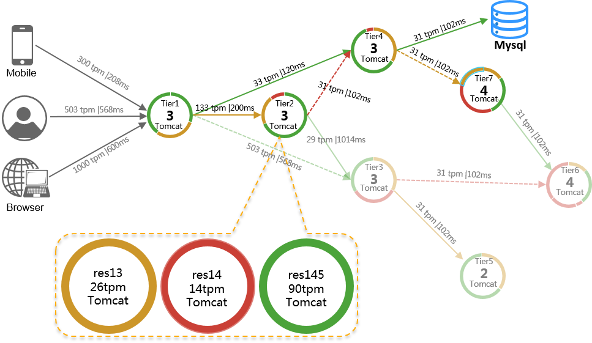
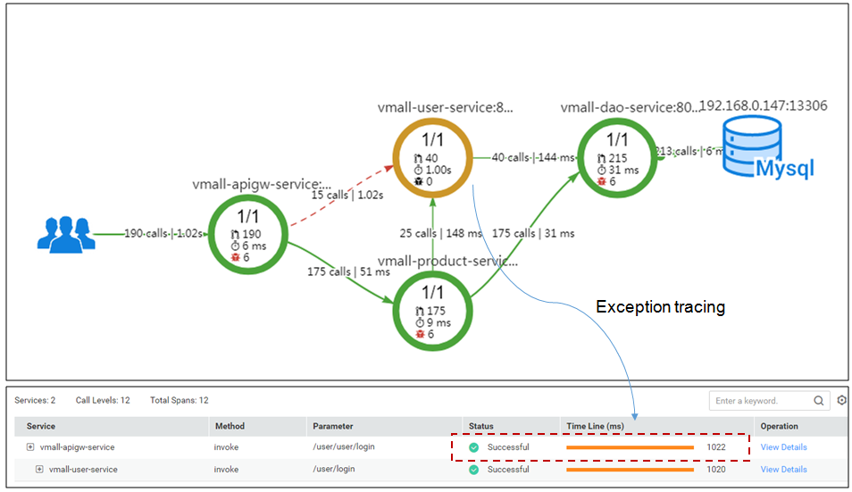
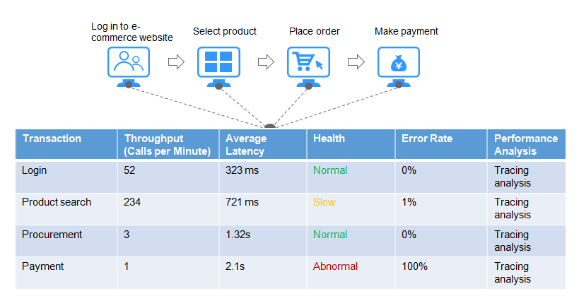

Multi-Dimensional O&M
~~~~~~~~~~~~~~~~~~~~~

The O&M system is designed to provide high-quality IT services. It
monitors underlying resources, applications, user experience, as well as
overall system running. It enables personnel to quickly respond to
issues, ensuring stable service running. With the changes in service
formats, architectures, resource models, and call relationships, the
cloud-based O&M system must provide refined and large-scale management.
There are several typical O&M requirements.

1. As service architecture evolves from monolithic and service-oriented
   to microservice-based, the number of services increases
   exponentially. Finer-granularity services are faster to iterate and
   more refined to manage. However, many microservices also pose great
   challenges to O&M in terms of management scale and timeliness.

2. In a large cloud-based distributed application system, service call
   relationships are complex. The call relationships, call quality, and
   latency in each phase need to be visualized so that problems can be
   detected and resolved in time.

3. After applications undergo microservice reconstruction, underlying
   resources are no longer hosted in physical machines and VMs; instead,
   they are hosted in containers or even run in serverless mode. Rapidly
   increasing service refinement and scale also mean exponential
   resource growth. When different types of resources are combined in
   services, O&M is even more complex. Personnel need refined and
   large-scale management capabilities to monitor resource usage in
   time.

4. Currently, applications use layered architectures, typically
   consisting of the web, service logic, data access, and database
   layers. To obtain required data, a request may go through multiple
   layers. O&M personnel need to be able to drill down links to monitor
   inter-layer access quality and serial/parallel relationships during
   troubleshooting.

5. Complex cloud resources and services are complicated by many accounts
   and operators, as well as frequent service changes. To ensure system
   stability, O&M personnel must have strong resource management,
   control, and audit capabilities to quickly detect abnormal operations
   and locate causes.

Huawei Cloud has built a multi-dimensional O&M system for cloud
applications. It integrates AOM, APM, log collection, and monitoring. It
monitors VMs, storage devices, networks, databases, and applications in
real time, and uses technologies such as application and resource alarm
correlation, log analysis, intelligent threshold, distributed tracing,
and mobile app exception analysis to quickly diagnose and rectify faults
within minutes, ensuring long-term and stable running of cloud
applications.

Multi-dimensional O&M monitors the infrastructure, application, and user
experience layers, and also provides logs and auditing.

CES
***

CES is a multi-dimensional resource monitoring service. Monitor
resources, set alarm rules, and improve resource utilization and
performance.

AOM
***

AOM is a one-stop cloud operations management platform for problem
management, monitoring, security, and performance. Streamline cloud
operational processes and effectively manage cloud hardware, software,
services, and networks.

APM
***

APM consists of application and frontend monitoring. Manage the
performance of your distributed applications, container environments,
browsers, applets, and apps. With full-stack performance monitoring and
E2E full-link tracing and diagnosis, application management is easy and
efficient.

APM has several features.

Full-link Topology
++++++++++++++++++

Clear Call Relationships, Easy Error Identification, and Convenient Resource Drill-down

The full-link topology displays the call relationships and dependencies
between applications, including application status, latency, errors, and
loads. View multiple open-source components, such as databases, caches,
message middleware, and NoSQL, filter information by time, service,
transaction, top SQL statistics, or other metrics, and drill down
resources to locate faults.

Tracing
+++++++

Bottleneck Identification and Fault Locating in Minutes

APM traces and records service calls, and displays the distributed
system's request execution tracks and statuses. When a service method is
called, the caller, detailed stack, and parameters of the method are
automatically captured for fast fault locating.

Transaction Analysis
++++++++++++++++++++

APM analyzes service flows on the service side in real time and displays
key metrics such as throughput, error rate, and latency. Abnormal
transactions trigger alarm reporting. Application Performance Index
(Apdex) is used to evaluate user satisfaction with applications. You can
view and trace the topology of any transaction with poor user experience
to locate the cause. An e-commerce application is used as an example
here.

LTS
***

LTS collects log data from hosts and cloud services. By processing
massive amounts of logs efficiently, securely, and in real time, LTS
provides useful insights for you to optimize the availability and
performance of your services and applications. It also helps you make
quick decisions, better manage and maintain devices, and analyze service
trends.

The following table shows open-source O&M products and their
corresponding Huawei Cloud products.

+------------+---------+------+---------------------------------------+
| Category   | Common  | Hu   | Function                              |
|            | Tool    | awei |                                       |
|            |         | C    |                                       |
|            |         | loud |                                       |
|            |         | Ser  |                                       |
|            |         | vice |                                       |
+============+=========+======+=======================================+
| Infr       | Zabbix  | `    | Monitors and generates alarms for     |
| astructure |         | CES  | infrastructure and instances.         |
| O&M        |         | <htt |                                       |
|            |         | ps:/ |                                       |
|            |         | /www |                                       |
|            |         | .hua |                                       |
|            |         | weic |                                       |
|            |         | loud |                                       |
|            |         | .com |                                       |
|            |         | /int |                                       |
|            |         | l/en |                                       |
|            |         | -us/ |                                       |
|            |         | prod |                                       |
|            |         | uct/ |                                       |
|            |         | ces. |                                       |
|            |         | html |                                       |
|            |         | >`__ |                                       |
+------------+---------+------+---------------------------------------+
|            | ELK     | `    | Collects and analyzes logs, generates |
|            |         | LTS  | alarms, and archives logs.            |
|            |         | <htt |                                       |
|            |         | ps:/ |                                       |
|            |         | /www |                                       |
|            |         | .hua |                                       |
|            |         | weic |                                       |
|            |         | loud |                                       |
|            |         | .com |                                       |
|            |         | /int |                                       |
|            |         | l/en |                                       |
|            |         | -us/ |                                       |
|            |         | prod |                                       |
|            |         | uct/ |                                       |
|            |         | lts. |                                       |
|            |         | html |                                       |
|            |         | >`__ |                                       |
+------------+---------+------+---------------------------------------+
| Applica    | Prom    | `    | Monitors applications and cloud       |
| tion-layer | etheus+ | AOM  | resources in real time, analyzes      |
| O&M        | Grafana | <htt | application health, and displays      |
|            |         | ps:/ | visual data, so that O&M personnel    |
|            |         | /www | can quickly detect faults and learn   |
|            |         | .hua | statuses of applications, resources,  |
|            |         | weic | and services.                         |
|            |         | loud |                                       |
|            |         | .com |                                       |
|            |         | /int |                                       |
|            |         | l/en |                                       |
|            |         | -us/ |                                       |
|            |         | prod |                                       |
|            |         | uct/ |                                       |
|            |         | aom. |                                       |
|            |         | html |                                       |
|            |         | >`__ |                                       |
+------------+---------+------+---------------------------------------+
| A          | Zi      | `    | Monitors and manages application      |
| pplication | pkin/Pi | APM  | performance and faults in real time,  |
| p          | npoint/ | <htt | and analyzes the performance of       |
| erformance | Sky     | ps:/ | distributed applications, helping O&M |
| management | Walking | /www | personnel quickly locate faults and   |
|            |         | .hua | performance bottlenecks.              |
|            |         | weic |                                       |
|            |         | loud |                                       |
|            |         | .com |                                       |
|            |         | /int |                                       |
|            |         | l/en |                                       |
|            |         | -us/ |                                       |
|            |         | prod |                                       |
|            |         | uct/ |                                       |
|            |         | apm. |                                       |
|            |         | html |                                       |
|            |         | >`__ |                                       |
+------------+---------+------+---------------------------------------+
| Service    | Service | `    | Monitors and analyzes behavior and    |
| monitoring | system  | LTS  | logs on the service side.             |
|            | O&M     | <htt |                                       |
|            | fu      | ps:/ |                                       |
|            | nctions | /www |                                       |
|            | and     | .hua |                                       |
|            | service | weic |                                       |
|            | logs    | loud |                                       |
|            |         | .com |                                       |
|            |         | /int |                                       |
|            |         | l/en |                                       |
|            |         | -us/ |                                       |
|            |         | prod |                                       |
|            |         | uct/ |                                       |
|            |         | lts. |                                       |
|            |         | html |                                       |
|            |         | >`__ |                                       |
+------------+---------+------+---------------------------------------+

.. toctree::
   :maxdepth: 1