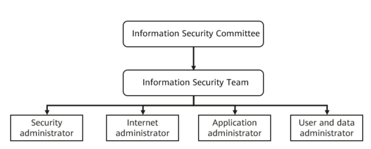

Security Management Organization
~~~~~~~~~~~~~~~~~~~~~~~~~~~~~~~~

Set up a security management organization and define its working
processes and the roles and responsibilities of its members.

A security management organization consists of an information security
committee and an information security team. The information security
team consists of a security administrator, a network administrator, an
application administrator, a data administrator, and the users. The
following figure shows a sample organization structure.

Responsibilities of the information security committee
******************************************************

-  Implement information security guidelines and policies, and review
   and approve the information system security construction plan.
-  Make decisions on major issues related to information system
   security.
-  Study and review systems, standards, and related policies in the
   construction and management of information system security, and
   coordinate relevant departments to supervise the implementation of
   systems and policies.
-  Arrange and guide activities to promote information security.

Information security team responsibilities
******************************************

-  Implement government requirements and regulations on information
   security.
-  Manage information security for business departments.
-  Be responsible for the security management system of the information
   system, including system construction, technical support, and
   operational regulations.
-  Handle the daily management of, and regularly improve, the disaster
   recovery system. Formulate and regularly revise standards for
   evaluation of a disaster recovery system.
-  Monitor the status of the disaster recovery system, organize drills,
   audit and evaluate the system, and provide suggestions for
   improvement.
-  If a major problem occurs in an information system, help related
   departments identify the cause and take immediate measures, such as
   initiating an emergency procedure.
-  Raise awareness of information system security through training or
   publicity.
-  Manage, inspect, and report information system security.
-  Prevent system-wide malicious code and manage network security.
-  Work with external security agencies. Obtain support from external
   security agencies in case of major security incidents.
-  Develop and improve information system security plans.
-  Manage, arrange, and supervise the security measures taken on
   information systems.
-  Build, operate, and manage the O&M system and technical support
   platform.
-  Arrange the formulation and implementation of the information system
   security O&M regulations.
-  Arrange responses to faults and emergencies.
-  Manage data utilization, query, and visualization.
-  Manage operations in the DR center.
-  Follow the instructions of the information security committee.
-  Develop information system security regulations, and technical
   assurance and operation regulations.
-  Regularly check information security status. If there are security
   incidents, report them in a timely manner, and work with related
   personnel in investigations and for troubleshooting.
-  Conduct training to raise security awareness among internal
   employees.

Security administrator responsibilities
***************************************

-  Be responsible for the security-related affairs of information
   systems, and assist in supervising the implementation and
   modification of the security system.
-  Be responsible for the implementation of the security regulations.
-  Develop and improve information system security plans.
-  Make a list of security equipment, systems, or other related assets.
   The list should include the departments, categories, IDs, names,
   importance, and locations of the assets.
-  Standardize security equipment or system management. Record asset
   owners and users, security equipment or system identifiers, and
   actions taken on the assets, such as purchase, use, change, and
   retirement.
-  Develop O&M procedures and related documentation for security
   equipment or systems, so that relevant personnel can operate the
   system in a standardized manner, avoiding information security
   incidents caused by misoperations.
-  Manage O&M of security equipment or systems, including regular
   inspections, maintenance, troubleshooting, and change management.
-  Assist managers in security training. Develop annual security
   training plans. Raise security awareness through training and
   publicity.
-  Develop a security inspection plan. Arrange inspections at least once
   a quarter. The plan should describe inspector responsibilities,
   inspection frequency, inspection scope and content, problem
   rectification, and inspection report. Conduct security inspections
   and report results. Collect, sort, and archive related materials.
-  Report security incidents in time. Assist with troubleshooting and
   rectification.
-  When a major problem occurs in the operation of the information
   system, assist the relevant departments in correctly determining the
   cause, and immediately take safety measures to initiate relevant
   processing procedures according to the instructions.
-  Work with external security agencies. Obtain their support when there
   are incidents.
-  Summarize security documents and forms semi-annually, and report the
   progress made in implementing security regulations.

Network administrator responsibilities
**************************************

-  Be responsible for network-related O&M, review, and changes, and
   archive related documents and data.
-  Manage network security development. Check whether the owners are
   fulfilling their responsibilities, catch up with the plan, and meet
   task requirements and quality standards.
-  Standardize the network management process. Record asset owners and
   users, security equipment or system identifiers, and actions taken on
   the assets, such as purchase, use, change, and retirement.
-  Adopt technical and management measures to enhance the security
   control over information systems. Continuously improve network
   security and stability, and logically isolate the external network of
   the information system from the Internet. Review and record network
   access. Arrange training about information system security.
-  Develop O&M procedures and related documentation for security
   equipment or systems, so that relevant personnel can operate the
   system in a standardized manner, avoiding information security
   incidents caused by misoperations.
-  Assist security administrators in deploying network security
   products. Manage the O&M of security equipment or systems, including
   regular inspections, maintenance, troubleshooting, and change
   management.
-  Implement multi-level approval regulations for network system
   changes, important operations, and access. Review routine
   applications. Report major changes to the Information Security
   Department.
-  Arrange emergency responses to network faults or incidents.

Application administrator responsibilities
******************************************

-  Manage O&M, application review, and changes in the application
   system. Archive the documents and data related to the application
   system.
-  Manage software development. Check whether the owners fulfill their
   responsibilities, catch up with the plan, and meet task requirements
   and quality standards. Set information security objectives during
   project establishment and approval to enhance the security of the
   system design and development process. Enhance code security. For
   outsourced software development, sign a confidentiality agreement
   with the service provider. During delivery acceptance, invite a
   third-party security organization to evaluate product security.
-  Standardize the management process of the information system. Record
   asset owners and users, security equipment or system identifiers, and
   actions taken on the assets, such as purchase, use, change, and
   retirement.
-  Develop O&M procedures and related documentation for important
   applications, so that relevant personnel can operate the system in a
   standardized manner, avoiding information security incidents caused
   by misoperations.
-  Standardize the asset management process of the application system.
   Record asset owners and users, security equipment or system
   identifiers, and actions taken on the assets, such as purchase, use,
   change, and retirement.
-  Manage routine security measures regarding password management,
   authorization, and approvals in the application system, so that
   employees can better comply with information security regulations.
-  Implement multi-level approval regulations for application system
   changes, important operations, and access. Review routine
   applications. Report major changes to the Information Security
   Department.
-  Arrange emergency responses to network faults or incidents.

User and data administrator responsibilities
********************************************

-  Provide technical support of large-scale application systems. Monitor
   and analyze daily operational data. Identify opportunities and pain
   points in business operations.
-  Conduct in-depth analysis and mining of customer demand models and
   data. Generate metrics-based warnings.
-  Manage and monitor accounts.
-  Ensure the database is running properly.
-  Identify and eliminate background problems and risks in a timely
   manner.
-  Fine-tune the system.
-  Plan and implement backup strategies.

.. toctree::
   :maxdepth: 1