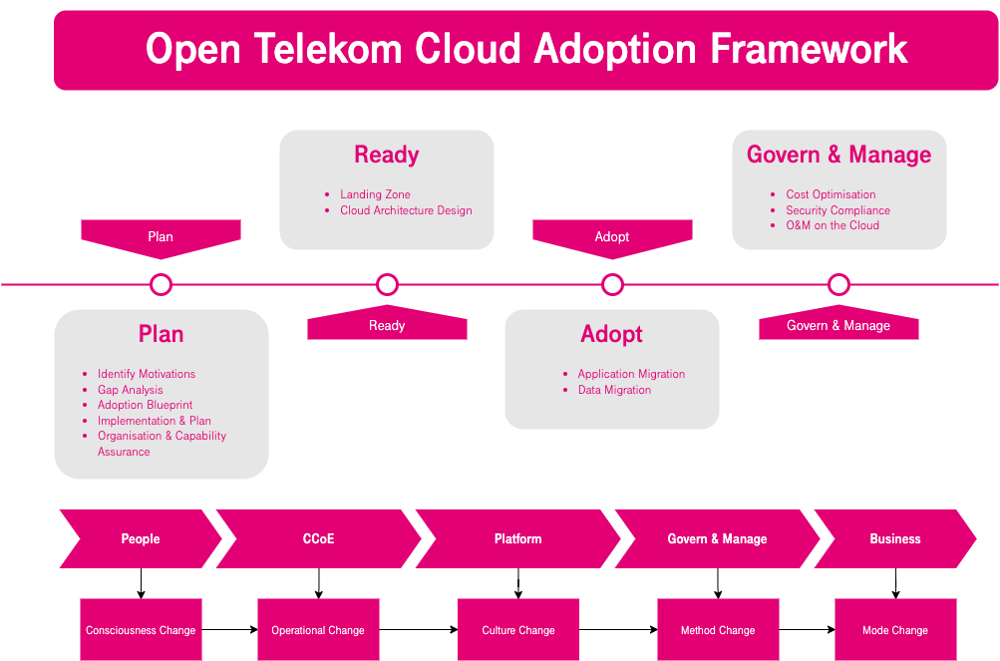

Cloud Adoption Framework
========================

Digital technologies, the digital economy, and new forms of digital competition are key initiatives for governments and enterprises across the globe to improve their digital services and cloud adoption.
Before migrating workloads to the cloud, governments and enterprises need to identify and prioritize the workloads.
They also need to know the value being brought by the cloud and ensure organizational capabilities.

Open Telekom Cloud Adoption Framework (OTCAF) aims to:

* Help organizations that need to go to the cloud clearly define the plan, strategies, methods, and best practices for cloud adoption so that they can systematically prepare for cloud adoption, and govern and manage services on the cloud.
* Help IT, finance, and security teams determine cloud adoption methods and governance to establish required capabilities.
* Help various roles achieve business objectives, and support organizations in building digital competitiveness for business success.

The OTCAF is based on references of our experts, partners and customers collected during
their own digital transformation journey, combined with our industry best practices.
It is divided into *four* phases as follows:

|

Phase 1: Plan
+++++++++++++++

Clarify the motivation for cloud adoption at the management level. It aims to define a cloud adoption blueprint, implementation and plan, and organization assurances. The scope is to address the cloud adoption strategy and convert the goals into action plans.

Phase 2: Ready
++++++++++++++

Build a Landing Zone and design the cloud architecture in preparation for the cloud adoption.
Landing Zone is used for unified management and governance of people, finances, resources, permission, and security compliance of multiple business units.
The cloud architecture may include IaaS, PaaS and SaaS capabilities, cloud management,
and O&M capabilities, providing features such as high availability, robust scalability, security compliance,
and cost-effectiveness.

Phase 3: Adopt
++++++++++++++

Migrate applications and data to the cloud in a proper order, and innovate services on the cloud.

Phase 4: Govern & Manage
++++++++++++++++++++++++++

Perform cost management, security compliance and governance, and cloud operation and maintenance (O&M) to ensure cost-effective, efficient, secure, and stable services running on the cloud.

Let's see these phases one by one:

.. toctree::
   :maxdepth: 1

   plan/index.rst
   ready/index.rst
   adopt/index.rst
   govern-and-manage/index.rst

Intended Audiences
++++++++++++++++++

Migrating workloads to the cloud is for any organisation large or small, public or private a very big
endeavor that requires the support and collaboration of various departments, people and skills. The
Open Telekom Cloud Adoption Framework is here to guide those heterogeneous stakeholders in every step
of the road. The audience that could be benefited from using OTCAF are mainly, but not limited to,
the following:

-  Cloud architects
-  Business and technology decisions makers
-  Product owners
-  Legal and finance
-  Information technology specialists on various fields (e.g administration, networking, security, governance)

