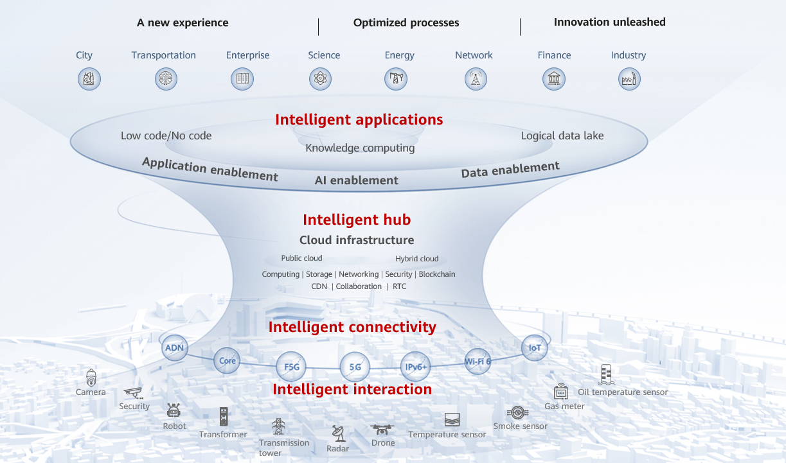

Cloud Adoption Blueprint
==========================

The adoption blueprint specifies the Cloud migration strategy, scope,
and objectives of key capability development:

Cloud migration strategy
************************

-  Determine the cloud deployment model: **public cloud or hybrid
   cloud**. Public cloud is more suitable for agile services and optimized
   costs. Hybrid cloud is a good choice for ensuring low service latency
   and enhanced security.

-  Define a **single-cloud or multi-cloud** strategy. A single-cloud
   strategy helps build leading capabilities while a multi-cloud
   strategy allows you to leverage the best capabilities of different
   cloud providers.

High level of collaboration
***************************

-  Vertical collaboration between central and local governments (states
   or provinces), as well as between enterprise headquarters and
   branches, including business, data, resource, and cloud-edge
   collaboration.

-  Horizontal collaboration includes hybrid cloud collaboration and DR
   across regions.

Cloud migration architecture and key capabilities
*************************************************

Complete the blueprint for cloud migration by layer and module in terms
of IaaS, PaaS, application enablement, application or SaaS, cloud
reliability, cloud security, cloud O&M, and cloud operations, including:

-  **Cloud infrastructure:** public cloud and hybrid cloud, multi-cloud
   management, multi-architecture computing, big data storage and
   computing, high-performance computing.

-  **Data lake:** data lake house, flexible import to the lake, data
   governance, data security, real-time self-service analysis, and
   intelligent data application...

-  **Enabling platforms:** AI, video, communications, IoT, blockchain, and
   related technologies

-  **Application migration to the cloud:** cloud migration scope and
   capability objectives

-  **Application innovation (optional):** cloud-native applications,
   DevCloud, and industry cloud

-  **Cloud reliability:** DR, HA, and related capabilities

-  **Cloud security:** security system for network, host, application and
   data, operations security, ecosystem security, and industry security
   certification

-  **Cloud O&M:** resource management, cloud monitoring

-  **Cloud operations:** operations platform, organization, and processes

A detailed cloud adoption blueprint is designed and planned based on the
current situation of the governments and enterprises. The following
figures are examples of the general reference architecture for
governments and enterprises.

The blueprint should be focused on cloud applications, cloud
infrastructure, application enablement or AI enablement or data
enablement platform capabilities. In addition, collaboration with
device-side or edge-side intelligent awareness interaction and
cloud-network synergy must be considered to ensure comprehensive access
to data and applications.

   **Figure 2-1** Reference architecture 1 for cloud adoption blueprint

|

   **Figure 2-2** Reference architecture 2 for cloud adoption blueprint

|

A blueprint for governments should be focused on building one cloud, one
network, and cognitive abilities. It should include new platforms for
technologies like big data, AI, video, and IoT, to accelerate innovation
in government, economy, and social services. Meanwhile, state-owned
enterprises can help ensure delivery and support operations.

   **Figure 2-3** Cloud adoption blueprint design for e-government

|

The blueprint for energy enterprises focuses on developing general
infrastructure and platform service capabilities, as well as building
dedicated capabilities based on scenario-based requirements of different
business processes.

.. figure:: ../../assets/caf/image10.png
   :alt: **Figure 2-4** Migration blueprint design for energy enterprises

   **Figure 2-4** Migration blueprint design for energy enterprises

.. toctree::
   :maxdepth: 1
