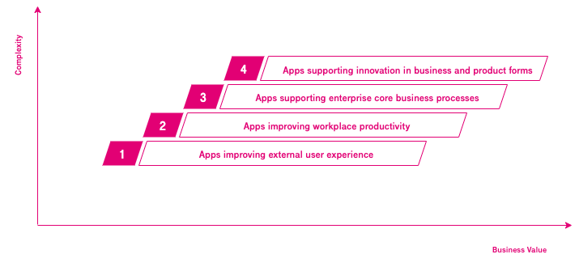
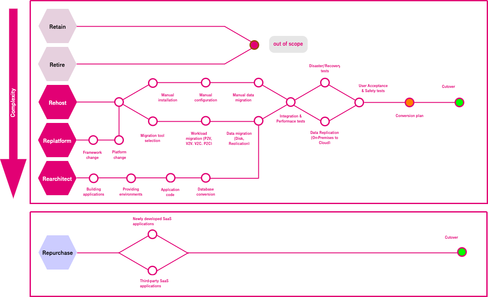

Cloud Migration Plan and Implementation
=======================================

Cloud migration is planned and implemented based on the infrastructure,
technical platform and key applications on the live network, along with
the cloud migration scope and key capability objectives specified in the
migration blueprint.

Our experts have summarized the following four steps based on its experience
in cloud migration:

-  **Step 1**: Apps improving external user experience

-  **Step 2**: Apps improving workplace productivity

-  **Step 3**: IT apps supporting enterprise core business processes

-  **Step 4**: Apps supporting innovation in business and product forms

|

|

Cloud migration strategies
**************************

-  **Retire**: Back up and decommission application systems that are no
   longer used to reduce resource waste.

-  **Retain**: Retain applications deemed unnecessary or unsuitable for
   cloud migration off the cloud due to resource costs, application
   lifecycles, or enterprise service policies. However, communication
   and data integration with other applications on the cloud are often
   required.

-  **Rehost**: Directly migrate applications to the cloud without changing
   the application running environment. The common migration operations
   are Physical to Virtual (P2V) and Virtual to Virtual (V2V).

-  **Replatform**: Replace the cloud-based PaaS platform, such as middleware
   and database, used by on-premises applications without changing the
   core application architecture. This lowers platform technical
   resource investment required, makes management less expensive, and
   enhances efficiency.

-  **Rearchitect**: Change the application architecture and development mode
   to build cloud-native capabilities. For example, monolithic
   applications are broken down into microservices. This strategy is
   used to support the long-term development of enterprise services on
   the cloud when existing applications cannot support subsequent
   function, performance, and scalability requirements.

-  **Repurchase**: Decommission legacy applications and replace them with
   new ones, such as newly developed SaaS applications or third-party
   SaaS services.

|

Cloud migration approach
************************

Before determining the cloud migration approach, prioritize applications
based on the following factors:

-  **Value and urgency**: For example, applications that have high
   requirements on elastic scaling and agility iteration in Internet
   services are of high value. If application servers are about to reach
   End of Life (EOL) or require cloud-based DR capabilities, cloud
   migration is urgent.

-  **Risk or service impact**: Low-latency applications (such as
   manufacturing applications) and core financial systems requires high
   performance, availability and data security control. Cloud migration
   has great impact on these services.

-  **Difficulty or service complexity of technical solutions**: If
   applications are not decoupled by layer and are complex with high
   dependency on peripheral equipment, the migration solution is
   difficult.

The following principles, which have been identified based on Open Telekom
Cloud's robust experience with system migration and application
reconstruction, can help ensure a smooth migration:

-  **Determine the migration sequence**: Evaluate the complexity and
   importance of applications. Preferentially migrate applications with
   high value, low migration impact, and low complexity.

-  **Migrating from edge to core**: Separately migrate services of different
   types, such as test services, office services, production services,
   and billing services. Start your migration with supporting
   applications and then move on to core applications.

-  **Independent applications first**: Migrate simple applications with few
   peripheral dependencies first.

-  **Integrity of application migration**: Ensure the integrity of the
   migration scope, objects, and process. Make sure that services are
   running properly after migration.

-  **Minimal impacts**: Consider all possible impacts of cloud migration on
   the running of the destination systems and take necessary measures to
   minimize risks.

Pilot project
*************

Select applications that are easy to migrate to the cloud, which has
strong driving force and great value for pilot projects to achieve quick
wins. During migration practice, build organizations, streamline
processes, build capabilities, and eliminate risks.

.. toctree::
   :maxdepth: 1