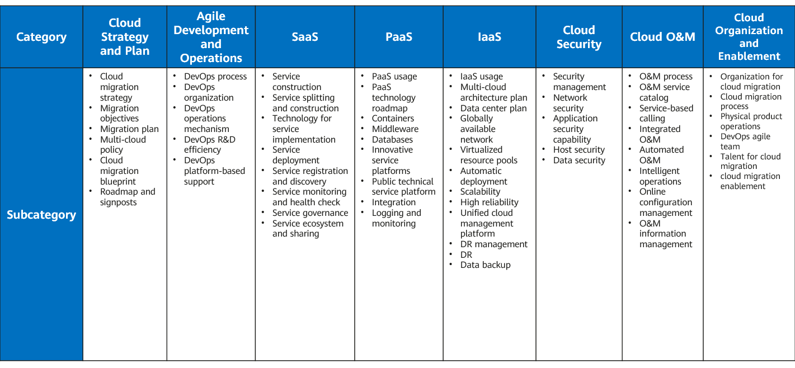

Gap Analysis
============

Before formulating your Cloud migration strategy:

-  Review the current accounts, special requirements, key issues and challenges of the current IT systems.
-  Identify new possible requirements for future service evolution.
-  Define the key cloud adoption objectives as required.

To get a complete analysis, refer to the following **Cloud Maturity Assessment Model**:

Key gap analysis tasks include:

Infrastructure analysis
***********************

-  Infrastructure resources and configurations, including servers,
   storage types, basic configurations, resource quantities and usages,
   lifecycle configurations, virtualization technologies,
   containerization, and application distribution.

-  Special requirements for performance, security, or operating system
   or hardware dependencies.

-  Key challenges, such as low availability and complicated maintenance.

Technical platform analysis
***************************

-  Basic platform details, such as the amount, scale, and usage of
   middleware, database, data warehouse, big data, and development and
   test platforms.

-  Special requirements and key challenges. For example, middleware and
   big data are developed based on open source software, which often has
   weak performance, poor stability, or no DR capabilities for critical
   services.

Major application analysis
**************************

Key applications need to be identified and analyzed to classify key
requirements for the implementation. This includes systems such as
channel systems, service systems, mission-critical systems, and data
related systems. Channel systems require flexible performance scaling
and fast iteration. Service systems need to be reliable and can expand
on demand. Mission-critical and data related systems require high
reliability, stability, and concurrency.

Design for X (DFX) capability analysis
**************************************

Review the challenges related to DR, security, performance, and O&M.

Evolution of innovation
***********************

New technologies such as AI, blockchain, and fast iteration based on
containers, microservices, and cloud-native can leverage the public
cloud for rapid reconstruction.

.. toctree::
   :maxdepth: 1