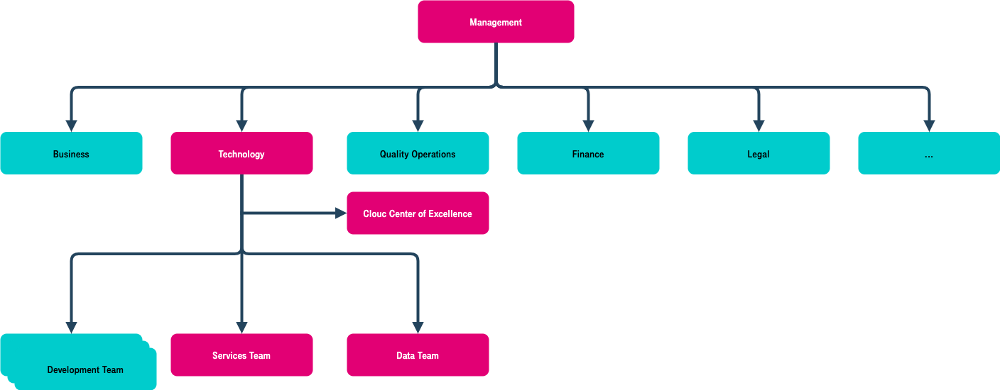

Organization and Capability Assurance
=====================================

It is a best practice to build organizations with appropriate skills to
ensure successful implementation of the cloud strategy and the
continuous evolution with vitality. The most efficient way is to build a
centralized governance team.

Management
**********

Service migration to the cloud involves changes in process,
organization, and culture. It requires a holistic approach and the
sponsorship of the top management. The core elements are as follows:

-  **Strategic clarity:** Identify the motivation for cloud migration
   and design a cloud migration plan at the strategic level, perform a
   risk/benefit analysis, and ensure that there is a clear consensus
   among the management team and relevant organizations.

-  **Grant budget:** During cloud migration, changes in resource
   procurement, resource usage, and internal settlement modes are
   involved. Budgeting and financial management are required to support
   smooth cloud migration.

-  **Cloud service provider selections:** To support continuous business
   innovation, cloud service providers need to have a strong B2B DNA.
   They need to be able to provide E2E services, share their
   experiences, and support continuous leaderships in cloud
   technologies. Selecting the right cloud service providers sets the
   stage for a successful cloud adoption.

-  **Organization optimization:** Set up a cloud migration organization
   that streamlines business and IT departments, specify the
   responsibilities and collaboration mechanism, and develop a
   decision-making and monitoring mechanism.

Cloud Center of Excellence
**************************

Cloud Center of Excellence (CCoE) supports the development of cloud
adoption strategies, assumes architecture responsibilities, selects best
solutions, and enhances organizational skills. This includes defining
cloud strategies and policies, designing blueprints, supporting cloud
service provider selection, leading architecture design, guiding cloud
service selection, and O&M governance. CCoE can be a virtual team that
requires collaboration between business and technical departments.

..  warning::

    CCoE **does not** handle routine operations and is not a project management organization.

CCoE includes, but not limited to, the following roles:

-  **Cloud strategy expert**: formulating and breaking down cloud strategies
-  **Cloud architecture expert**: designing cloud architecture and
   formulating migration strategies
-  **Security compliance expert**: planning security cloud services, as well
   as building, verifying, and deploying security policies
-  **Business, finance, legal affairs, quality and operation experts**

Service team
************

The cloud Service team is responsible for the following stages:

-  **Cloud construction**: A cloud infrastructure needs to be built. This
   includes a PaaS, service enablement platform, DR, and various
   security capabilities. In addition to cloud management functions,
   cloud management needs to be integrated into the overall enterprise
   O&M management system to further build self-service resource
   management and intelligent O&M capabilities.

-  **Cloud migration**: One or more *development teams* also need to get involved in
   the cloud migration process. They will be responsible for developing
   and implementing the cloud migration solution.

-  **Cloud management**: Resources and permissions need to be managed, and
   costs on the cloud need to be controlled and optimized. Configuration
   and deployment policies need to be optimized for reliability,
   security, cost, performance, security compliance.

Data team
*********

The Data team is responsible for the following tasks:

-  **Data platform setup**: A data platform needs to be set up based on
   cloud service capabilities and it needs to meet industry requirements
   for performance, scalability, cost, reliability, and security.

-  **Data management**: The data, business and cloud service teams need to
   work together on data integration, data development, data governance,
   data services, and data security. They need to support data
   requirements, ensure data quality, control data risks, and handle or
   escalate data issues and disputes as need for final decisions.

-  **Data asset operations**: The team needs to conduct internal data
   sharing and exchange, formulate data usage rule and process, monitor
   traffic, and run external data asset monetization operations to
   promote trusted data circulation.

.. note::

    Depending on the organization's needs, the cloud Service team and Data
    team can be deployed *together or separately*. In the government sector,
    for example, the cloud Service team and the Data team can work together.
    In some enterprises, however, the cloud service team and the data team
    have to work separately.

Personnel development plan
**************************

After services are migrated to the cloud, traditional IT work, such as
O&M and security, will change significantly. Cloud service providers
offer infrastructure and technology platforms. IT departments of
governments and enterprises focus more on service requirements and
capability building. Employees need to master cloud architecture
technologies for cloud solutions, cloud migration, cloud governance, and
data management and operation capabilities that integrate with their own
scenarios. They also need to always be learning the application
capabilities of new technologies to meet government and enterprise
service innovation requirements. They need to keep up with the latest
AI, IoT, blockchain, microservices, and DevSecOps concepts on the cloud.

The personnel development plan needs to cultivate new capabilities that
match the cloud service model through the training and transformation of
original personnel, as well as introduction of talent to implement the
cloud migration strategy.

.. toctree::
   :maxdepth: 1
