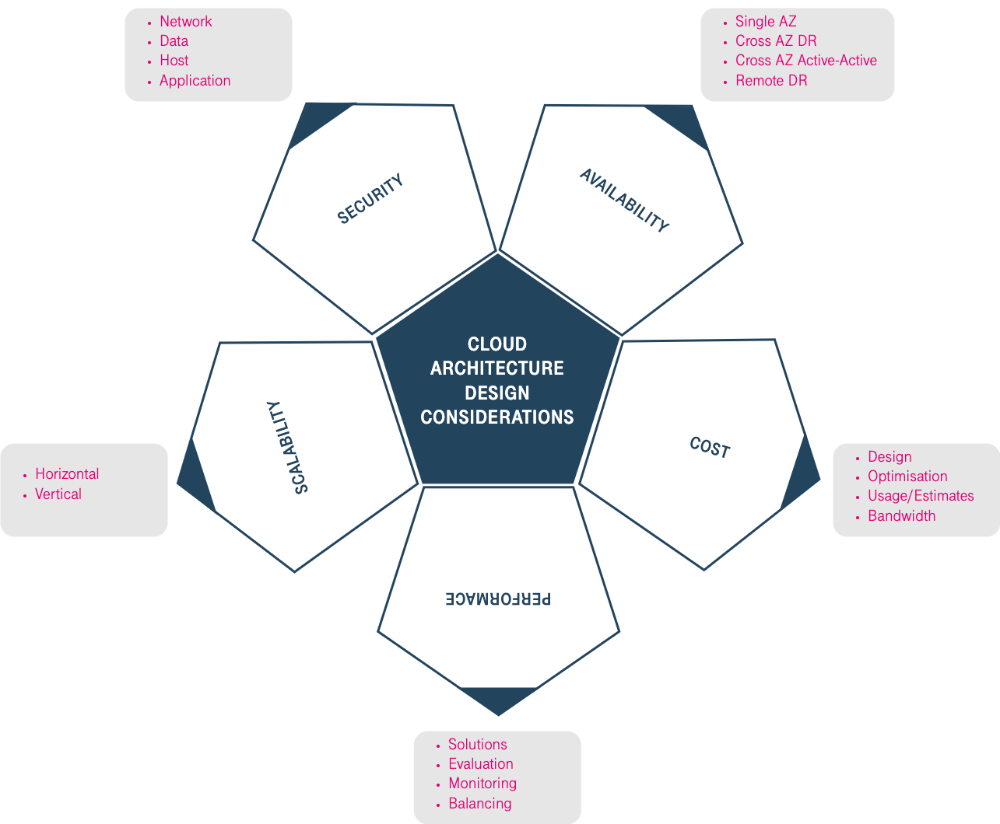

Cloud Architecture Design
-------------------------

The most important objective of architecture design is to ensure the
continuous availability of the system along with the development of
enterprise services. Architecture design mainly includes the design of
the application architecture and the technical architecture. The
application architecture design involves industry-specific features,
technology stacks, and enterprise development phases. Designing the
technical architecture is more general. In the following sections, we
will describe the five aspects of architecture design that affect
service continuity the most: high availability (HA), scalability,
performance, security, and cost.

|

.. toctree::
   :maxdepth: 1

   high-availability.rst
   scalability.rst
   performance.rst
   security.rst
   cost.rst