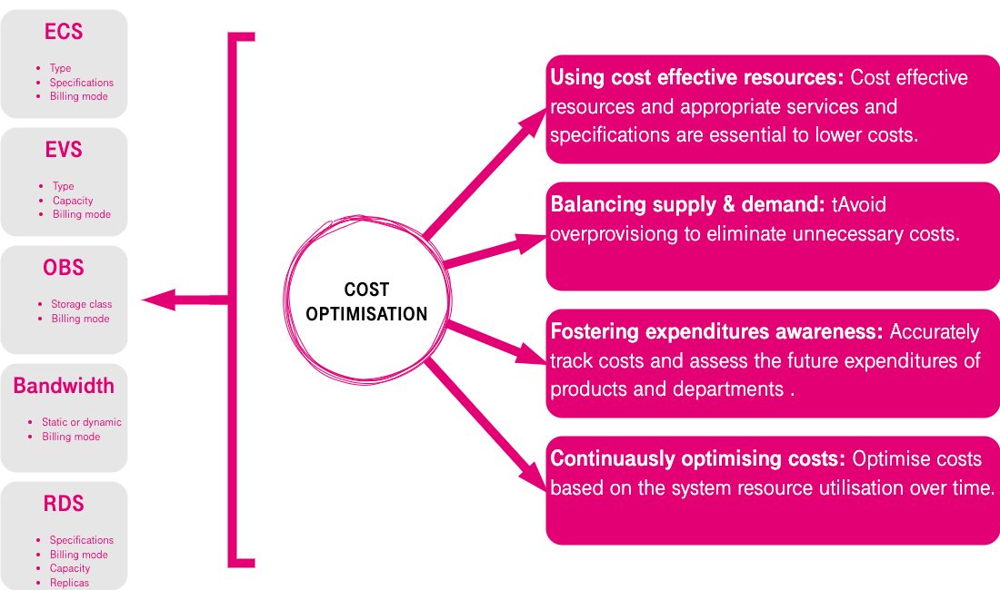

Cost
~~~~

On-demand resource usage, usage-based billing, elastic scaling, and
resource utilization determine the costs on cloud. The following figure
shows the principles of cost optimization design. For details about the
design content, see section "Cost Management".

.. toctree::
   :maxdepth: 1