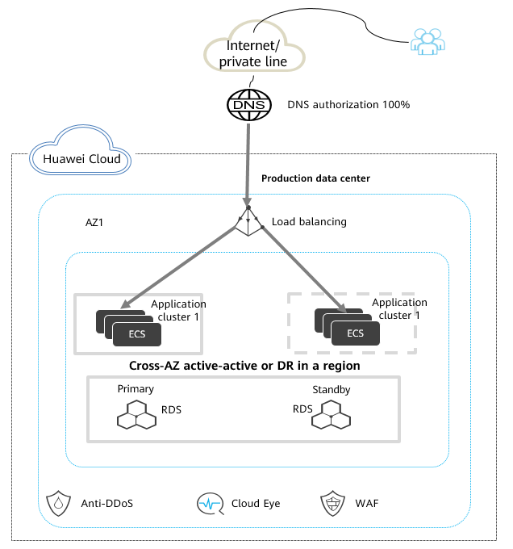
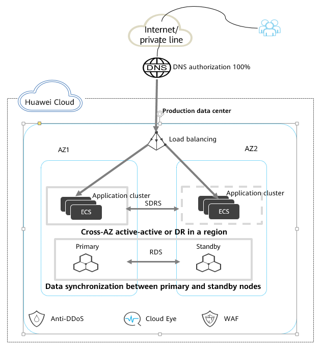
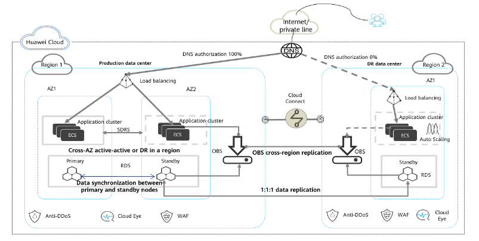

High Availability
=================

Availability Definition
----------------------

Availability refers to the ability of a product or service to perform a
specified function under specified conditions at a specified time or
within a specified period of time. It is a measure of the reliability
and maintainability of the product.

Service availability is generally
measured by the SLA. Each type of cloud service provides services based
on their SLA commitment. The following table lists the downtimes
acceptable for different SLA commitments:

+---------+-------------------+--------------------+------------------+
| SLA     | Weekly Downtime   | Monthly Downtime   | Yearly Downtime  |
+=========+===================+====================+==================+
| 99%     | 1.68 hours        | 7.2 hours          | 3.65 days        |
+---------+-------------------+--------------------+------------------+
| 99.90%  | 10.1 minutes      | 43.2 minutes       | 8.76 hours       |
+---------+-------------------+--------------------+------------------+
| 99.95%  | 5 minutes         | 21.6 minutes       | 4.38 hours       |
+---------+-------------------+--------------------+------------------+
| 99.99%  | 1.01 minutes      | 4.32 minutes       | 52.56 minutes    |
+---------+-------------------+--------------------+------------------+
| 100.00% | 6 seconds         | 25.9 seconds       | 5.26 minutes     |
+---------+-------------------+--------------------+------------------+

High Availability Solutions
---------------------------

Most Open Telekom Cloud services have HA deployment options available. They
provide you with HA capabilities at multiple layers, including data
centers, hardware, data, and self-service. Open Telekom Cloud data centers are
deployed in Germany, Netherlands and Switzerland to meet resource requirements
for different regions. Each region is divided into multiple availability zones (AZs).
Each AZ has independent cooling, fire extinguishing, moisture-control,
and electrical facilities, and the failure of one AZ does not affect
other AZs. There are four types of HA deployments:

-  **Single-AZ HA**: For services that do not require high availability,
   active/standby or cluster deployment models of cloud services can be
   used to quickly recover services in the event of a single service
   node failure. By using automatic fault detection and switchover of
   nodes in a cluster, single points of failure (SPOFs) are eliminated
   and service interruptions are prevented.

-  **Dual-AZ (intra-city) HA**: For services that require high
   availability, you can deploy services in multiple equipment rooms in
   the same city. This way, service continuity is guaranteed even if the
   network, physical device, or power supply of one equipment room
   fails. Open Telekom Cloud users can deploy services across AZs. AZs are
   isolated from each other, so if one AZ fails, you can switch services
   to another AZ to quickly recover services. Most cloud service
   products have corresponding capabilities. Select your desired
   capabilities during purchase and complete deployment.

-  **Two-site three-center HA**: For some ultra-large or commercial
   systems that demand extra robust protection, the dual-AZ (intra-city)
   HA solution is still insufficient. It cannot guard against regional
   disasters, such as an earthquake or a flood. A remote equipment room
   is required for that. So in a two-site three-center HA solution, you
   add a remote DR equipment room to the intra-city solution. That way,
   you are protected even in the event of a regional disaster.

-  **Cross-cloud HA**: To meet the requirements for multi-cloud HA of
   some enterprises, Open Telekom Cloud also supports multi-cloud DR
   deployment. Enterprises can deploy production services on Open Telekom
   Cloud and deploy the DR site on a cloud vendor platform.

.. todo::
   review the above, especially the last whether is feasible in OTC

Single-AZ HA Solution Design
^^^^^^^^^^^^^^^^^^^^^^^^^^^^

Solution description and key points of the design:

-  **Layered service deployment**: web access layer, service layer, data
   layer, and management zone
-  **Service HA**: No single-node deployment, HA deployment (in cluster or
   active/standby mode)
-  **Cloud service HA**: The selected Open Telekom Cloud services are deployed in
   the HA mode.

From the perspective of service continuity and data availability, this
solution achieves cluster and active/standby HA. Instead of using single
nodes, applications are deployed in clusters or active/standby mode.
This may be a more expensive option, but it significantly improves
availability.

Key points of the HA design:

+--------+-------------------------------------------------------------+
| Item   | HA Design Focuses                                           |
+========+=============================================================+
| S      | Decoupled deployment: Different components are deployed on  |
| ervice | different ECSs.                                             |
| HA     |                                                             |
|        | HA deployment: HA deployment is used for all nodes. If HA   |
|        | (active/standby or cluster) deployment is not supported, an |
|        | emergency solution must be available, for example, cloud    |
|        | server backup (via CSBS) and an emergency environment.      |
|        |                                                             |
|        | Layered deployment: Services are deployed separately on the |
|        | web layer, service layer, and database layer.               |
|        |                                                             |
|        | Auto scaling: The Auto Scaling service can be leveraged to  |
|        | adjust compute resources to deal with changes in service    |
|        | volume.                                                     |
+--------+-------------------------------------------------------------+
| Cloud  | -  Network access layer:                                    |
| s      |                                                             |
| ervice | -  Private line: Active-active or active/standby HA         |
| HA     |                                                             |
|        | -  VPN: private line (active) + VPN (standby) or VPN        |
|        |    (active) + VPN (standby)                                 |
|        |                                                             |
|        | -  ELB: Multiple ECSs run at the ELB backend to ensure      |
|        |    system availability and scalability. Health check is     |
|        |    enabled. ELB is a potential fault point in the system    |
|        |    and needs to be monitored by CES.                        |
|        |                                                             |
|        | -  NAT gateway: If a large number of ECSs need to access    |
|        |    the Internet, use SNAT to prevent too many ECSs from     |
|        |    being exposed to the Internet.                           |
|        |                                                             |
|        | -  Selection of cloud service types (RDS, DCS, and more):   |
|        |                                                             |
|        | Production services must use active/standby or cluster      |
|        | deployment. For example, RDS DB instances must be deployed  |
|        | in primary/standby mode, and Redis must be deployed in      |
|        | clusters. Self-built services on ECSs must also meet this   |
|        | requirement, for example, deployed using Redis Cluster.     |
+--------+-------------------------------------------------------------+
| Data   | -  Data backup and restoration solutions are available. For |
| relia  |    example, VBS and CSBS are used to back up ECS data, and  |
| bility |    an RDS backup policy is enabled. Critical data is backed |
|        |    up to other regions or offline IDCs.                     |
|        |                                                             |
|        | -  Data backup and recovery reliability, and emergency      |
|        |    drills are periodically verified.                        |
+--------+-------------------------------------------------------------+

Dual-AZ HA Solution Design
^^^^^^^^^^^^^^^^^^^^^^^^^^

Solution description and key points of the design:

-  **Service modules**: For services supporting cluster deployment,
   resources are deployed in two AZs, with the loads balanced using ELB.
   For single-node ECSs, SDRS is used for AZ-level DR.
-  Cloud service HA: Primary and standby nodes are deployed in different
   AZs.
-  **Database synchronization**: RDS is used, and RDS DB instances are
   deployed in primary/standby mode across AZs and the data kept
   synchronized.
-  **DR switchover**: If an AZ fails, RDS database services automatically
   switch to the standby databases. Application services can be taken
   over by the DR servers automatically or in just a few clicks.
-  **DR drills**: Users can perform DR drills with just a few clicks.

Two-Site Three-Center (Cross-Region) HA Solution Design
^^^^^^^^^^^^^^^^^^^^^^^^^^^^^^^^^^^^^^^^^^^^^^^^^^^^^^^

Solution description and key points of the design:

-  The production centers and DR center are deployed in two different
   regions of Open Telekom Cloud.
-  The production centers are deployed in two AZs, and the DR center is
   deployed in one AZ.
-  RDS DB instances are deployed in both the production centers and DR
   center for 1:1:1 primary/standby replication.
-  Configurations, logs, snapshots, and backups generated at the
   production and DR centers are replicated across regions using OBS.
-  If one production AZ fails, services are switched to the other AZ,
   and a database switchover is performed.
-  If both production centers fail, a database switchover is performed,
   and by modifying DNS configuration, 100% of the user traffic is
   directed to the DR center.
-  After the production centers recover, a database switchover is
   performed, and DNS directs 100% of the user traffic to the production
   centers.
-  To improve the utilization of the DR center, some read-only or
   analysis services can be distributed to the DR center.

.. note::
    -  This solution provides the highest possible service continuity and
       data availability. Data and services can be protected even in the
       event of regional disasters.

    -  The RPO it determined by the database replication interval. Servers
       at the DR center are always running, so an RTO of almost zero can be
       achieved. The time needed to complete a DR switchover depends on how
       long the DNS cache takes to update. It usually takes a few minutes
       and can be faster if GSLB is used.

Establishing HA DR capabilities is a complex project that includes
ingress traffic control, service layer reconstruction, middleware and
database control, and the collaboration of numerous systems. It requires
professional skills to build HA DR systems. If customers lack related
experience and want to quickly build an HA DR system, the Multi-cloud
high Availability Service (MAS) is a good choice. This service is
derived from the multi-cloud application HA solution of Open Telekom Cloud consumer
services. It provides end-to-end service failover and DR drill
capabilities that include everything from the traffic ingress and
application layer, to the data layer. MAS ensures quick service recovery
and improved service continuity.

.. toctree::
   :maxdepth: 1