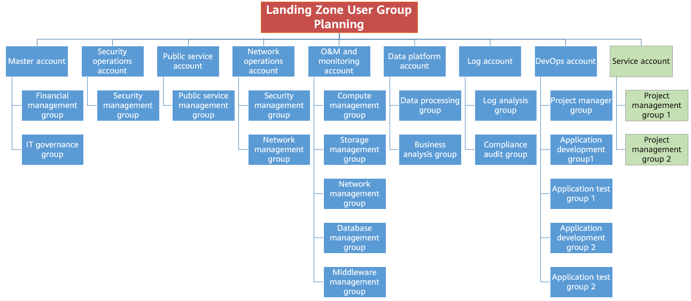
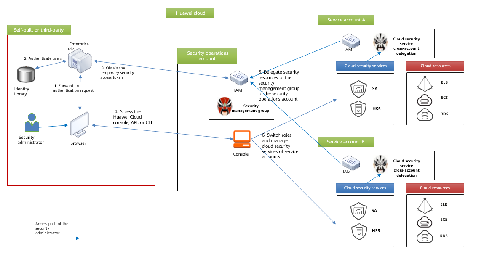
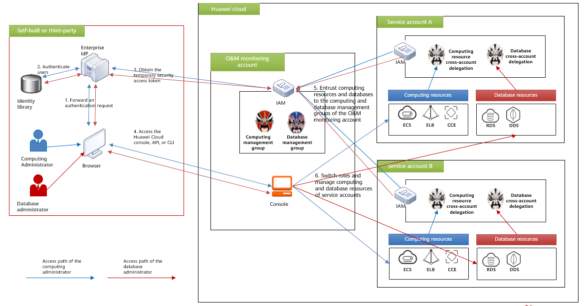

Identity and Permissions Design
-------------------------------

Based on a large number of successfully delivered projects, Open Telekom Cloud
has summarized the following user and permissions management principles:

-  Establish trust between the enterprise's identity management system
   (such as AD) and Open Telekom Cloud IAM for federated identity
   authentication so that enterprise employees can use single sign-on
   (SSO) for the Open Telekom Cloud console. The enterprise's identity
   management system can better control the permissions of employees as
   they are recruited and can revoke permissions in a timely manner for
   employees who have transferred to different departments or have
   resigned.

-  Do not use Open Telekom Cloud IAM as the enterprise's user management
   system. There is no need to create users or user groups on Open Telekom
   Cloud IAM for enterprise employees who do not interact with Open Telekom
   Cloud.

-  Do not share passwords with others. Instead, create an independent
   user and assign permissions to the user for people who needs to
   manage or use Open Telekom Cloud resources. In this way, all operations
   performed on Open Telekom Cloud can be tracked and audited.

-  Create user groups based on IT functions and add corresponding
   employees to user groups that match their responsibilities. For
   example, in terms of resource O&M and management, apply unified
   management and O&M principles to improve efficiency. Under the O&M
   and monitoring account, create user groups based on O&M
   responsibilities. These user groups include a computing management
   group, storage management group, network management group, and
   database management group.

-  Follow the principle of least privilege (PoLP). Grant only the
   minimum levels of access or permissions needed to user groups. If the
   responsibilities of a user group change, adjust the permissions of
   that user group in a timely manner. To simply operations, grant
   permissions to user groups rather than individual users.

-  The IAM account administrator (with the same name as the IAM user)
   has high permissions. As such, you should not use this account to
   access Open Telekom Cloud directly. Instead, create an IAM user and grant
   permissions based on the PoLP principle to perform routine
   management, protecting the security of IAM accounts.

Based on these principles, user groups are planned for accounts in
Landing Zone and corresponding cloud service access permissions are
assigned to these user groups based on the PoLP principle on Open Telekom
Cloud. User groups in the enterprise's identity management system are
mapped to the user groups on Open Telekom Cloud so that they have the
corresponding cloud service access permissions.

|

To achieve unified management and control, IT functional accounts of
Landing Zone need to access and manage cloud resources under other
accounts through cross-account delegation. For example, a security
operations account is designed to centrally manage security resources
and services (such as SA and HSS) across accounts through federated
authentication and cross-account delegation. The security administrator
logs in to the console of the security operations account through SSO,
switches the role to a service account, and then accesses and manages
security cloud services under that service account.

|

Another similar scenario is that the O&M and monitoring account can
access resources in other accounts through federated authentication and
cross-account delegation to monitor and manage resources across accounts
in an enterprise.

.. toctree::
   :maxdepth: 1