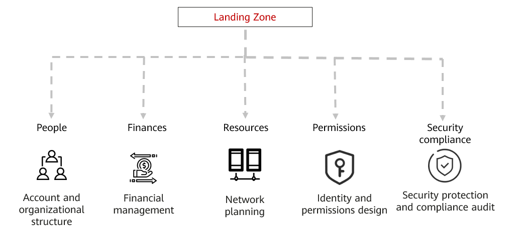

Reference Architecture
----------------------

The people, finances, resources, permissions, and security compliance
requirements are mapped to the account and organizational structures,
financial management, network planning, identity and permissions design,
security protection, and compliance audit.

The following describes each module in detail.

.. toctree::
   :maxdepth: 1

   account-and-organizational-structure.rst
   account-management.rst
   network-planning.rst
   identity-and-permissions-design.rst
   security-and-compliance.rst