Network Planning
^^^^^^^^^^^^^^^^

An enterprise migration to the cloud requires proper planning of the
network architecture. You need to review the current status of the data
center network and operational model and translate them as multi-account and network design plans on
the cloud (including VPCs, subnets, and communication between cloud and on-premises networks).

.. todo::
   remove all references of Huawei in images

On-Premises Network Review
''''''''''''''''''''''''''

Review the current status of the on-premises data center network to plan
for the cloud account and networking.

-  Functions and service bearing of each data center.

-  Mapping between on-premises data centers and regions and AZs on the
   cloud.

-  Network architectures and partitions within and between data centers.

-  Application system distribution and data flow between services.

Cloud Network Account Design
''''''''''''''''''''''''''''

Plan cloud accounts based on the network plan. There are three scenarios
to consider:

-  **One account and one VPC**: Account management and O&M are easy as there
   is a small team but security is low.

-  **One account, multiple VPCs**: Account management is easy and there is
   better security. The VPCs are designed for different functions and
   have different access control rules.

-  **Multiple accounts or primary account and sub-accounts, multiple VPCs**:
   Account management is more challenging as there is a large team with
   multiple branches and complex services, and meeting security
   requirements can be challenging too. If multiple VPCs are deployed in
   the same region, enterprise router should be used to connect them. If
   multiple VPCs are deployed in different regions, you can use Cloud
   Connect.


The first and second scenarios are *simple*. They mainly involve VPC and
subnet planning. For details, see section "Cloud Networking
Planning and Design". **The following section will be focused on the third
scenario**.

The following figure shows a multiple account, multiple VPC network
architecture.

|

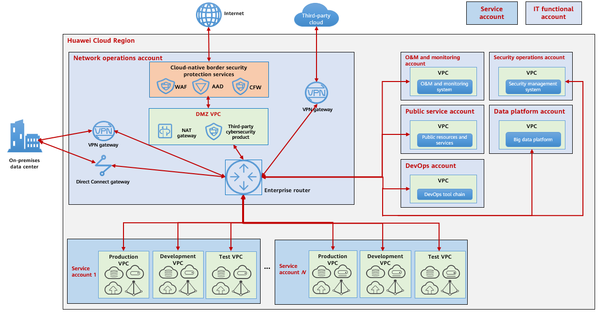

|

At the core of this architecture is the *network operations account*,
which serves as a hub to connect different accounts. Its enterprise
router allows communication between resources of different accounts. The
enterprise router lets you configure routes to determine which VPCs can
communicate with each other.

A large service system usually has independent sub-accounts. You are
advised to create three VPCs:

-  a production VPC
-  a development VPC
-  and a test VPC

These VPCs are kept isolated from each other for the
service system. Each VPC must have *at least two subnets*: an
application subnet and a data subnet. These correspond to,
respectively, the application layer and data layer of the service
system. Network ACLs are then used for access control between
subnets. Resources such as ECSs, DCS instances, and RDS instances can
be added to security groups for instance-level access control based
on security group rules. Application clusters of service systems can
be deployed across AZs to ensure high availability at the application
layer. The active/standby database clusters and DCS clusters across
AZs on Open Telekom Cloud are used to ensure high availability at the data
layer.

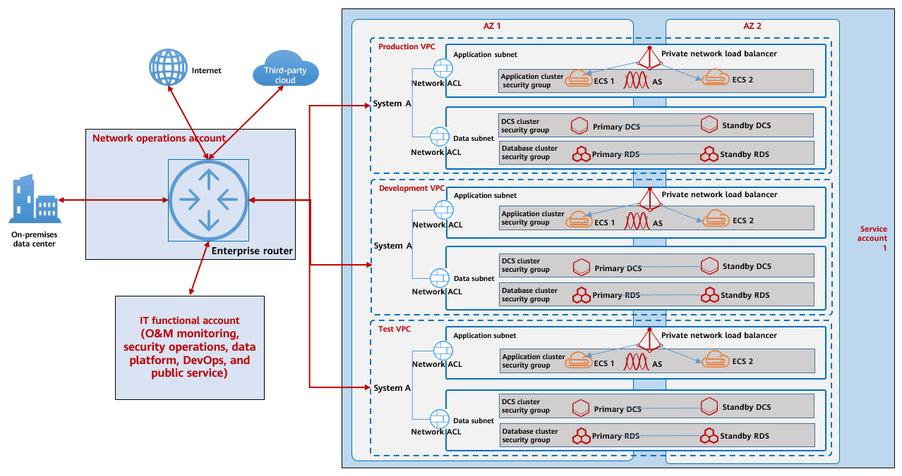

.. note::
    It is a best practice to create an enterprise project for each
    small-scale service system, associate the resources of each system in
    the production, development, and test VPCs with the same enterprise
    project or tag, and perform cost collection and fine-grained
    authorization based on the enterprise project or tags.

Cloud Networking Planning and Design
''''''''''''''''''''''''''''''''''''

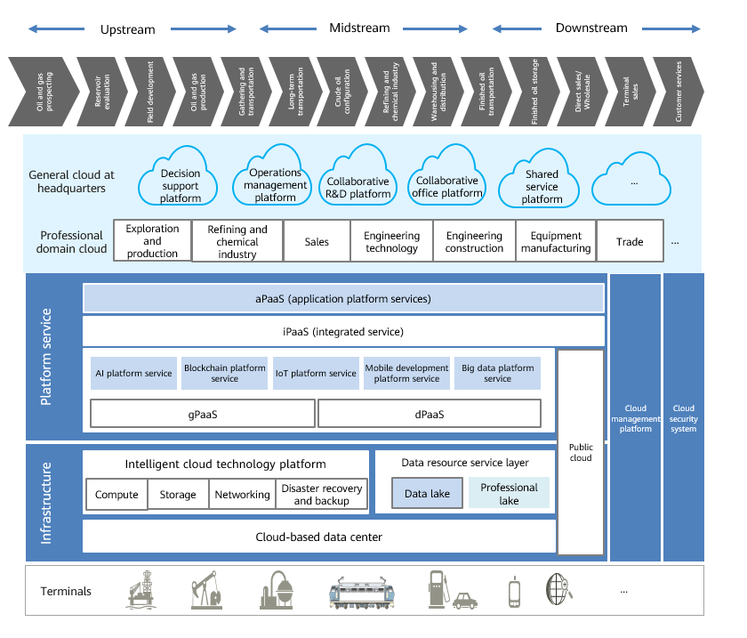
   following scenarios include VPC and subnet on the cloud, Internet
   communication on the cloud, O&M network on the cloud, and communication
   between cloud and on-premises networks.

VPCs and Subnets
****************

VPC is a virtual private cloud. It is a logical isolated environment that all the networking components
live, e.g. subnets, security groups, routing tables, gateways etc.

VPCs
````

-  Each VPC can have **up to** 5,000 IP addresses.
-  VPCs are isolated by default. Enterprise routers can be used to allow communication between VPCs.
-  There are O&M VPCs, DMZ VPCs, and service VPCs. Different VPCs are connected through enterprise routers.
-  Each service VPC belongs to an independent service system or a department. Service systems or departments that do not need to access each other are deployed in different VPCs.
-  VPCs can be deployed across AZs. Services can be deployed in such VPCs for high availability.
-  By default, the production VPC is isolated from the development and test VPCs and no VPC peering connection is established. You are advised to use OBS for data transmission.

Subnets
```````

-  Enterprise subnets must be planned to prevent them from overlapping
   with each other.
-  Subnets in the same VPC cannot overlap. Subnets in VPCs that need to
   communicate cannot overlap.
-  Different service systems should be deployed in different subnets.
   You can use network ACLs to control access between subnets.
-  Different subnets should be used for application deployment and data
   storage. By default, data subnets can only be accessed by application
   subnets. Application subnets can be accessed by other subnets or from
   the Internet if required.
-  O&M subnets allow access from other subnets if needed.

Internet communication on the cloud
***********************************

**Solution 1:** With WAF for web service protection

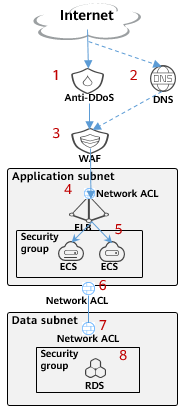

#. Enable Anti-DDoS for EIPs for traffic scrubbing. If the traffic is heavy, use Advanced Anti-DDoS.
#. Configure the CNAME in DNS to redirect domain names to WAF.
#. Use WAF to protect the web domain names and then redirect traffic to ELB.
#. Use an ELB whitelist to allow access only from the WAF IP addresses.
#. Use the security group of ECSs in the application subnet to allow access only from specific IP address ranges over specific ports.
#. Use the network ACL of the application subnet to allow communication with only WAF IP addresses and the database subnet.
#. Use the network ACL of the database subnet to allow access only from the application subnet to the database IP address and port.
#. Use the security group of the database to restrict the ports and IP address ranges that it can access.
#. Host security and database security are alternative services.

**Solution 2:** Without WAF for web service protection

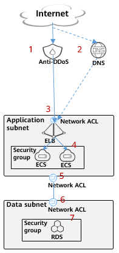

#. Enable Anti-DDoS for EIPs for traffic scrubbing. If the traffic is heavy, use Advanced Anti-DDoS.
#. Configure the DNS to resolve the domain name to the EIP of the ELB.
#. (Optional) Use an ELB whitelist and blacklist to allow access only from specific IP address ranges.
#. Use the security group of ECSs in the application subnet to allow access only from specific IP address ranges over specific ports.
#. Use the network ACL of the application subnet to allow communication with only the database subnet.
#. Use the network ACL of the database subnet to allow access only from the application subnet to the database IP address and port.
#. Use the security group of the database to restrict the ports and IP address ranges that it can access.
#. Host security and database security are alternative services.

Cloud O&M network
*****************

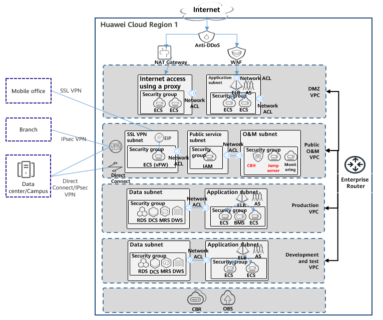

#. Enterprise maintenance personnel can access the enterprise internal
   network through the public O&M VPC and then perform O&M on cloud
   resources through the CBH.
#. The public O&M VPC communicates with other VPCs through the
   enterprise router. Network ACLs are configured to allow on-premises
   subnets to access only the subnets that provide services externally
   on the cloud. All instances are maintained only through the O&M subnet.
#. The network ACL and security group of the O&M subnet allow access only from specific on-premises subnets.
#. Each VPC uses a network ACL to allow communication with the O&M subnet on specific ports.
#. All maintenance operations must be performed on the CBH. The operation processes are recorded and can be audited.

Cloud and on-premises network communication
*******************************************

The following table compares the services that can be used to connect
cloud and on-premises networks. You can select one based on your
requirements.

+----------+------------+-------------+-------------+------------------+
| Co       |            | Direct      | VPN         | SD-WAN Network   |
| mparison |            | Connect     |             |                  |
| Item     |            |             |             |                  |
+==========+============+=============+=============+==================+
| Arch     | Network    | High,       | Low, no     | Medium           |
| itecture | quality    | guaranteed  | guaranteed  |                  |
|          |            | SLA         | SLA         | The Internet is  |
|          |            |             |             | connected to the |
|          |            |             |             | nearest POP      |
|          |            |             |             | (                |
|          |            |             |             | active/standby). |
|          |            |             |             | Direct Connect   |
|          |            |             |             | uses the         |
|          |            |             |             | backbone network |
|          |            |             |             | and ensures the  |
|          |            |             |             | network SLA on   |
|          |            |             |             | Open Telekom Cloud.    |
+----------+------------+-------------+-------------+------------------+
|          | Network    | Low, billed | High,       | Medium, billed   |
|          | f          | annually,   | pay-per-use | annually,        |
|          | lexibility | bandwidth   | billing,    | bandwidth can be |
|          |            | not easy to | can be      | flexibly         |
|          |            | adjust      | adjusted at | adjusted         |
|          |            |             | any time    |                  |
+----------+------------+-------------+-------------+------------------+
|          | Hardware   | Universal   | Universal   | Independently    |
|          | dependency | router      | VPN device  | purchased SD-WAN |
|          |            |             |             | devices          |
+----------+------------+-------------+-------------+------------------+
|          | Extended   | None        | None        | Security and     |
|          | services   |             |             | acceleration     |
|          |            |             |             | services         |
+----------+------------+-------------+-------------+------------------+
| Cost     | Line       | High, 10X   | Low, 1X     | Medium, 3X       |
+----------+------------+-------------+-------------+------------------+
|          | Time       | Months      | Hours       | Days (including  |
|          | required   |             |             | equipment        |
|          |            |             |             | delivery)        |
+----------+------------+-------------+-------------+------------------+
|          | M          | P           | P           | No professional  |
|          | aintenance | rofessional | rofessional | maintenance      |
|          |            | maintenance | maintenance | personnel        |
|          |            | personnel,  | personnel,  | required, easy   |
|          |            | no unified  | no unified  | on-premises      |
|          |            | management  | management  | configuration,   |
|          |            |             |             | unified cloud    |
|          |            |             |             | management, and  |
|          |            |             |             | guaranteed       |
|          |            |             |             | network quality  |
+----------+------------+-------------+-------------+------------------+

Connect networks of on-premises data centers, campus, branches, and mobile offices to Open Telekom Cloud
*************************************************************************************************

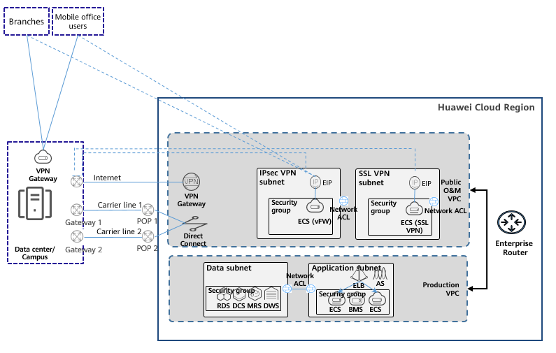

On-premise data center/campus
`````````````````````````````

The on-premises data center or campus
is connected to Open Telekom Cloud securely and reliably, can access the
Internet through the resources on the cloud to reduce costs, and can
directly use public cloud services through the private network.

**Solution 1:** Use Direct Connect (one or two private lines) to connect
to Open Telekom Cloud public O&M VPC.

**Solution 2:** Use IPsec VPN to connect to Open Telekom Cloud public O&M VPC.

Branches
````````

An enterprise with multiple branches needs to connect each
of its branch networks to Open Telekom Cloud in a secure and low-latency way.

**Solution 1:** Use IPsec VPN to connect to Open Telekom Cloud public O&M VPC.

**Solution 2:** Use the VPN or the Direct Connect connection of the
on-premises data center or campus to connect to Open Telekom Cloud public O&M
VPC.

Mobile offices or stores
```````````````````````

An enterprise may have many offline stores
or branches. Business systems such as mobile POS systems need to
interact with cloud systems (such as ERP) in real time and require
robust encryption and low network latency. The security and stability of
a public network cannot be guaranteed, and Direct Connect is an
expensive solution.

**Solution 1:** Use an SSL VPN to connect to a Open Telekom Cloud public O&M
VPC.

**Solution 2:** Use the VPN or Direct Connect of the on-premises data
center or campus to connect to Open Telekom Cloud public O&M VPC.

Migration of on-premises servers to the cloud without IP address changes
````````````````````````````````````````````````````````````````````````

Sometimes, to ensure service continuity, the customer does
not want to change the IP addresses of their systems after the
systems are migrated to the cloud.

**Solution:** T-Systems provides L2CG to allow cloud and on-premises
networks to communicate at Layer 2. Migration can be performed on an IP
address basis and IP addresses can remain unchanged to ensure that
services are not affected during the migration.

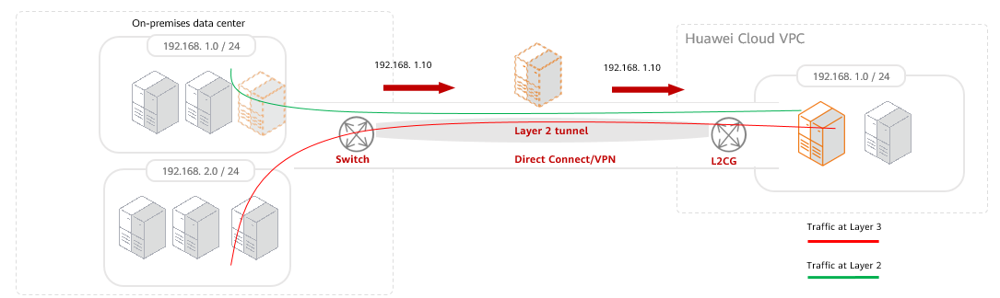

On-premises data center access through the private network
``````````````````````````````````````````````````````````

Instead of using an Internet connection, enterprise users access
cloud services (such as OBS, SWR, and API Gateway) directly over a
private network.

**Solution:** After an on-premises data center connects to Open Telekom Cloud
through Direct Connect or VPN, the data center can access cloud services
through the private network using VPC endpoint, which is secure,
efficient, and cost-effective.

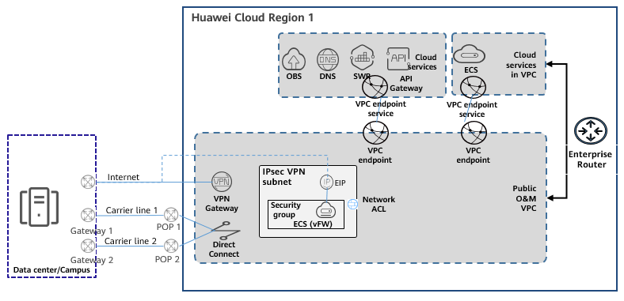

On-premises data center accessing the Internet through Open Telekom Cloud
```````````````````````````````````````````````````````````````````

If the public network used by the data center is of poor
quality and expensive, the data center can be connected to Open Telekom
Cloud through Direct Connect. Then it can use the resources on the
cloud to access the Internet, both reducing costs and improving the
quality of their public network access.

**Solution 1:** With Direct Connect and DNAT, on-premises and cloud
networks share a public network egress.

**Solution 2:** With Direct Connect and SNAT, campus offices share the
cloud public network egress for Internet access.

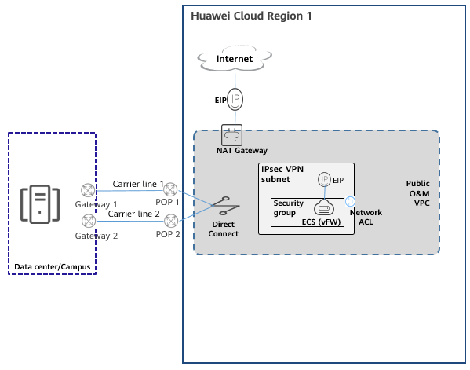

Overlapping IP address ranges
`````````````````````````````

Suppose the departments of an
enterprise use overlapping subnets. The enterprise has decided to
migrate to the cloud, but they want to keep the subnets unchanged,
and they need them to be able to communicate with each other after
they are migrated.

**Solution:** Open Telekom Cloud provides private NAT gateways for private IP
address mapping. As shown in the following figure, you can create a
transit VPC and use a private NAT gateway to convert the IP address of a
service department. IP address 192.168.0.3, of the service department,
is mapped to 10.0.0.33, and 192.168.0.3, of the security department, is
mapped to 10.0.0.22. In this way, the two departments can communicate
with each other even though their subnets overlap.

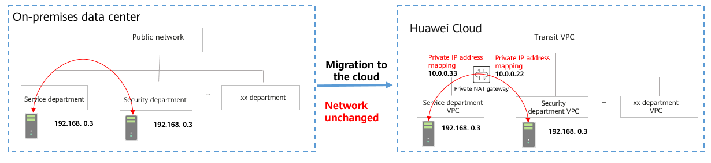

Cloud and on-premises load balancing
````````````````````````````````````

In this scenario, some
services are still in the on-premises equipment room and use ELB on
the cloud to provide services for external systems. Cloud resources
supplement the data center capacity to handle traffic peaks.

**Solution:** Use ELB to distribute traffic requests for both cloud and
on-premises resources.

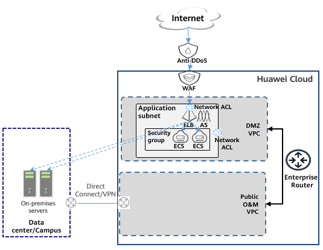

.. toctree::
   :maxdepth: 1