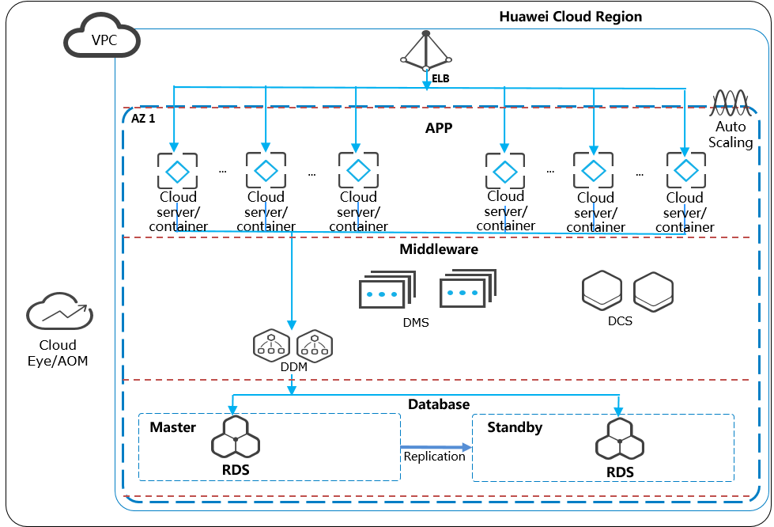

Scalability
~~~~~~~~~~~

Scalability on the Cloud
^^^^^^^^^^^^^^^^^^^^^^^^

Compared with traditional IDCs, the cloud has more abundant resources
and powerful scalability. There are different types of scaling designed
for different service scenarios.

-  Vertical scaling: For monolithic applications, independent
   applications, and stateful applications, hardware sometimes needs to
   be rapidly upgraded to handle changes in demand as services develop.
   For example, during promotions, these applications often require many
   times more resources than normal. In this case, companies can use a
   UI or open APIs to quickly upgrade resources by adding more vCPUs,
   memory, bandwidth, and disk space, to handle increasing workloads.
   After the activities have ended, they can restore the resources to
   the original specifications to keep costs down.

-  Horizontal scaling: For distributed applications, stateless
   applications, and rapidly changing applications, resources allocated
   in fixed ratios struggle to keep up with rapid changes in demand.
   With horizontal scaling, applications can take advantage of abundant
   resources of the cloud to rapidly scale out or in based on
   pre-configured scaling policies to handle traffic fluctuations both
   during and after promotional activities. In addition, these
   applications can consistently, flexibly get more resources as
   workloads keep rising.

-  Extreme scaling: To respond to unexpected traffic bursts, such as if
   there are major breaking news, a system needs to support extreme
   expansion capability. When such events take place, it may need to
   rapidly add thousands of compute cores. In this case, scaling on the
   cloud is the best choice.

There are several different ways to configure scaling:

-  On a schedule: You can create a scheduled task to scale in or out
   resources at a specified time.

-  Using metrics. You can create an alarm-triggered task to monitor
   resource performance metrics such as CPU usage and average network
   traffic. When the monitored metric reaches the specified value, an
   alarm is triggered and resource scaling is performed.

-  Based on a configured range. You can configure upper and lower
   capacity limits. When the number of compute instances is below the
   lower limit or above the upper limit, the system automatically adds
   or removes instances so that the number of instances stay within a
   certain range.

-  Manually. You can add, remove, or delete existing resources manually.

Scalable Solution Design
^^^^^^^^^^^^^^^^^^^^^^^^

Scalable capabilities can be designed by layer. The preceding figure
shows the scalability of Huawei Cloud services at different levels. The
scalable design of each layer is as follows:

-  Application layer: If this layer uses a microservice architecture and
   container-based application deployment using Cloud Container Engine
   (CCE) on Huawei cloud, with the auto scaling capability of CCE,
   applications can automatically scale out and in on demand. During the
   auto scaling triggered by alarms from AOM, service pods are
   automatically added or removed in response to workload fluctuations.
   If this layer is deployed using Huawei Cloud Elastic Cloud Server
   (ECS), applications can automatically scale out or in based on
   scaling policies configured on Auto Scaling.

-  Message middleware layer: Huawei Cloud Distributed Message Service
   (DMS) for RabbitMQ Premium instances are deployed in clusters, and
   can scale up or down as the message volume and workload changes.

-  Cache middleware layer: The master/standby Distributed Cache Service
   (DCS) for Redis instances from Huawei Cloud can scale up or down as
   the hot data volume increases or decreases.

-  Database middleware layer: The distributed database middleware uses
   Huawei Cloud Distributed Database Middleware (DDM), which is deployed
   in a cluster. With the increase of database services, the DDM cluster
   specifications can be smoothly expanded to cope with more database
   processing.

-  Database layer: Huawei Cloud Relational Database Service (RDS)
   supports smooth expansion of read-only database instances for
   scenarios where much more data is read than written. By working with
   DDM, multiple instances can be scaled out. Data in large tables is
   horizontally split and evenly distributed to database instances,
   improving database capacity and performance. In addition, GaussDB
   databases use an architecture with decoupled storage and compute to
   support minute-level horizontal expansion and reduce service
   interruptions.

.. toctree::
   :maxdepth: 1