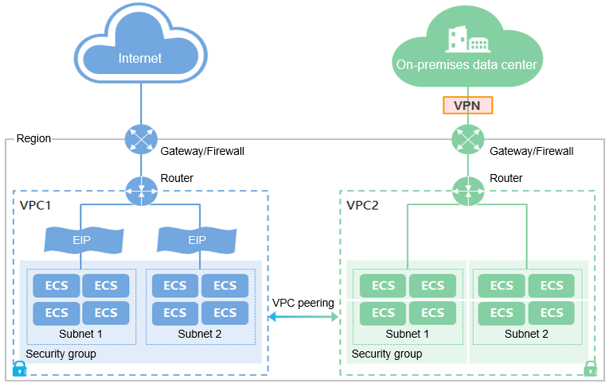
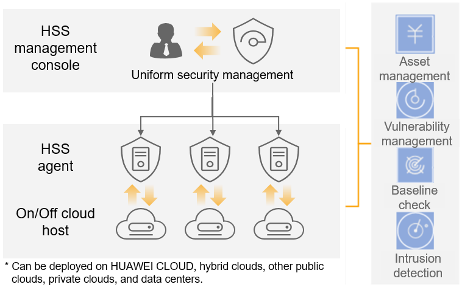
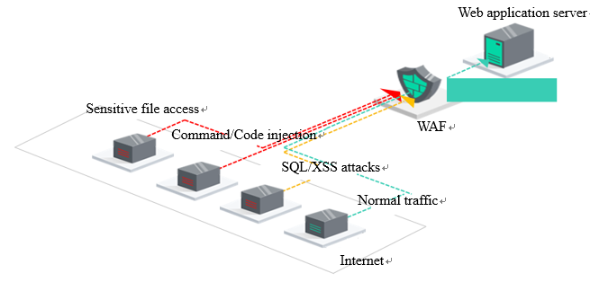
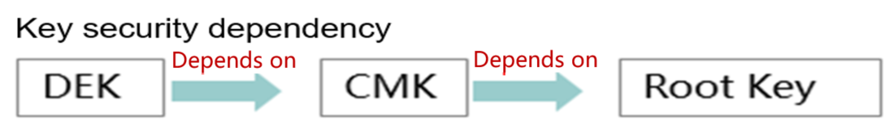

Security & Compliance
=====================

Security
--------

The security of landing zone includes:

-  Virtual network security
-  Host security
-  Application security
-  Data security
-  Security management

Virtual network security
************************

Virtual Private Cloud (VPC) allows you to build isolated, configurable,
and manageable virtual networks for Elastic Cloud Servers (ECSs),
improving the security of cloud resources and simplifying the network
deployment of service systems.



|

Related VPC functions:

-  **Subnet**: A subnet is a range of IP addresses in your VPC and provides
   IP address management and DNS resolution functions for ECSs in it. By
   default, ECSs in all subnets of the same VPC can communicate with one
   another, but ECSs in different VPCs cannot.
-  **Network ACL**: A network ACL allows you to create rules to control
   traffic in and out of one or more subnets.
-  **Security group**: A security group is a collection of access control
   rules for ECSs that have the same security protection requirements
   and that are mutually trusted within a VPC. You can define access
   rules for ECSs in a security group and between security groups.
-  **VPN**: A VPN is used to establish a secure and encrypted communication
   channel between remote users and a VPC, allowing remote users to use
   resources in the VPC. By default, ECSs in a VPC cannot communicate
   with user data centers or private networks. To enable the
   communication, you can use VPN.
-  **Direct Connect**: Direct Connect is a private line that connects
   on-premises data center to the cloud. Users can use Direct Connect to
   connect its on-premises data centers, offices, or hosting areas to
   the cloud, reducing network latency and obtaining a faster and more
   secure network experience.

Host security
*************

.. warning::
   this doesnt exist in OTC

Host Security Service
`````````````````````

Host Security Service (HSS) helps you identify and manage the assets
on your servers; manage programs, file integrity, security
operations, and vulnerabilities; check for unsafe settings; and
defend against risks, intrusions, and web page tampering in real
time. There are also advanced protection and security operations
functions available to help you easily detect and handle threats. HSS
functions include intrusion detection, file integrity management,
remote login monitoring, ransomware protection, unified asset
management, vulnerability management, baseline checks, web page
tamper-proofing, and user-defined policies.



Container Guard Service
```````````````````````

Container Guard Service (CGS) scans for vulnerabilities in container
images, manages container security policies, and prevents container
escapes. CGS can help you with vulnerability management, process
whitelisting, file protection, and runtime monitoring.

Application security
********************

Web Application Firewall
````````````````````````

Web Application Firewall (WAF) helps you inspect and protect website
service traffic. WAF uses deep machine learning to identify malicious
requests and defend against unknown threats, blocking common attacks
such as SQL injections and cross-site scripting (XSS). WAF prevents
intrusions and attacks from affecting the availability and security
of web applications or consuming excessive resources, reducing the
risk of data tampering and theft. WAF enables HTTPS protection, IP
blacklist and whitelist, traffic blocking based on location
information, common web attack blocking, attack penalty, user-defined
access control, CC attack mitigation, zero-day vulnerability virtual
patching, dynamic anti-crawler, and alarm notification.



Advanced Anti-DDoS
``````````````````

Advanced Anti-DDoS (AAD) is deployed at the network border of cloud
services. AAD can protect Internet servers (including off-cloud
servers), so that services will not be interrupted by heavy-traffic
DDoS attacks. You can divert attack traffic to a high-defense IP
address for cleaning, so your source servers will be stable and
reliable. AAD features include network defense, web application
defense, geographical location filtering, and traffic forwarding &
load balancing.

Data security
*************

Data Encryption Workshop
````````````````````````

.. warning::
   I see DEW everywhere in the documentation but I cannot find anything relevant in Console

On the public cloud, Data Encryption Workshop (DEW) has been integrated
into multiple cloud services, such as EVS, OBS, and SFS. You can take
advantage of DEW APIs to develop your own encryption applications.

DEW encryption keys include data encryption keys (DEKs), customer
master keys (CMKs), and root keys. The following figure shows their
dependencies.



DEKs are encrypted using CMKs, and CMKs are protected by root keys. A
root key is generated using a UKey when third-party hardware is
initialized and is available to users and cloud service providers.

Database Security Service
`````````````````````````
DBSS can detect SQL injection attacks, manage high-risk operations, and
audit databases.

Security management
*******************

Identity and Access Management
``````````````````````````````

Identity and Access Management (IAM) enables fine-grained
hierarchical authorization to control tenant operations and resource
usage under an enterprise account. You can configure password
policies, login policies, ACLs, multi-factor authentication (MFA),
and manage permissions to prevent destructive operations from being
performed by individual users.

Cloud Bastion Host
``````````````````

.. warning::
   CBH doesnt exists in OTC services, although there is a reference once
   in the documentation. Should we provide a solution in Terraform instead ?

Cloud Bastion Host (CBH) has various functional modules, such as
department, user, resource, policy, operation, and audit modules. It
integrates features such as single sign-on (SSO), unified asset
management, multi-terminal access protocols, file transfer, and
session collaboration. With the unified O&M login portal,
protocol-based forward proxy, and remote access isolation
technologies, CBH enables centralized, simplified, secure auditing
for cloud resources, such as servers, cloud hosts, databases, and
application systems.

Compliance Audit
----------------

To ensure that the runtime environment of an enterprise meets the
security compliance requirements of countries, industries, and
enterprises after cloud migration, Landing Zone provides the following
security compliance measures:

-  **Separation of duty (SoD)**: A multi-account architecture is used for
   SOD. Each account is an SOD unit. An enterprise can group accounts
   based on service units, geographic units, and functional units. The
   loss of any account does not affect the system as a whole, limiting
   the impact radius.

-  **Operation audits**: Operation audits are enabled for each account so
   anytime a resource is accessed by any entity, that activity is
   logged. All operations can be tracked. Audit logs of all accounts are
   centrally stored and analyzed.

-  **Configuration change tracking**: Resource configuration recording is
   enabled for each account to log any resource configuration changes.
   All resource changes can be tracked. Change logs are centrally stored
   and analyzed.

-  **Security guardrails**: There are two types of security guardrails. They
   are security redlines and security baselines. Security redlines, also
   called preventive security guardrails, forcibly restrict the
   permissions of member accounts to avoid security risks caused by
   excessive permissions. The fine-grained authorization mentioned
   earlier can be used to set security redlines. Security baselines,
   also called detection security guardrails, require that member
   accounts meet basic security compliance requirements. For example,
   MFA must be enabled for the root user and EVS disks must be
   encrypted.

.. note::

    For details about the **complete security baseline check
    items**, see the Open Telekom Cloud official website: https://support.huaweicloud.com/intl/en-us/usermanual-sa/sa_01_0021.html

-  **Unified identity and permissions management**: Users, user groups, and
   permissions in a multi-account environment are centrally managed to
   enable a user to access resources under multiple accounts. Unified
   identity and permissions management reduces the workload of
   permissions management and facilitates the development and
   implementation of unified permissions standards within an enterprise,
   reducing security risks caused by improper permissions assignment.

-  **Unified security control**: Security events and risks in a
   multi-account environment are identified, processed, and analyzed,
   and events are responded to and handled centrally. Unified security
   control reduces the workload involved in security control and
   facilitates the development and implementation of unified security
   regulations within an enterprise. The implementation requires cloud
   security services to support unified security management and control
   of multiple accounts.

.. toctree::
   :maxdepth: 1