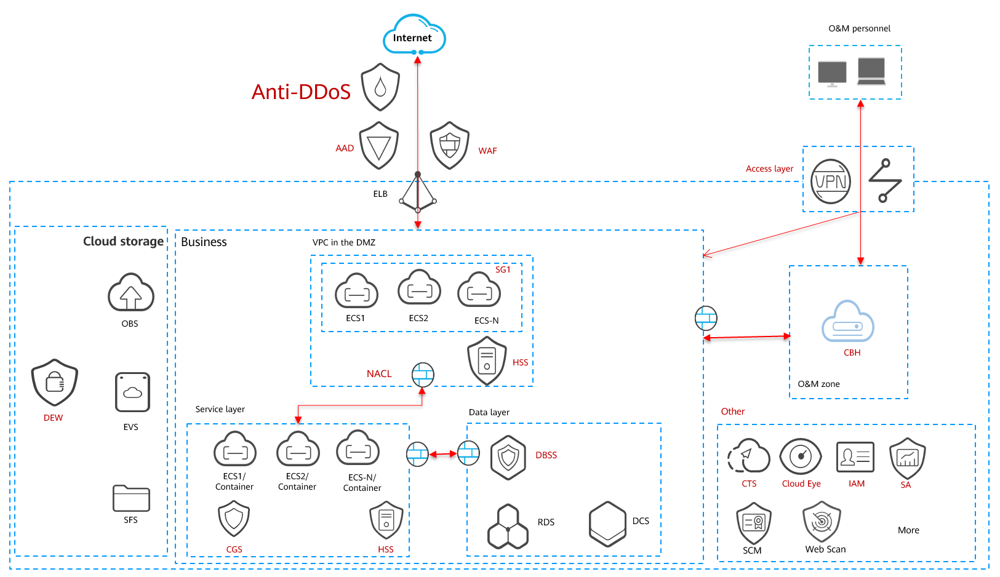

Security
~~~~~~~~

Cloud customers need the following security capabilities:

-  Service continuity, such as network attack blocking, intrusion
   prevention, and legal compliance.
-  Data confidentiality, such as defense against unauthorized access
   from external parties, insiders, and cloud service providers.
-  Manageable O&M, such as security policies, risk identification and
   handling, and operation audit and tracing.

The architecture is designed to enhance the following aspects of network
security:

-  Region boundaries

-  Boundary protection: controlled connections, illegal private
   connection prevention, illegal external connection prevention, and
   wireless access restriction

-  Access control policies

-  Intrusion prevention: known threat prevention, unknown threat
   prevention, and intrusion audits

-  Malicious code prevention: malicious code detection and spam
   filtering

-  System audits: user behavior audit, security event audit and analysis

-  Network communications

-  Network architecture: performance redundancy, link redundancy, device
   redundancy, and partition isolation

-  Communication and transmission: The encryption technology is used to
   ensure data confidentiality and integrity during transmission.

-  Computing environment

-  Identity identification: identity uniqueness and credential
   complexity

-  Access control: user permissions management and redundant account
   clearance

-  Security audit: user behavior audits and audit process protection

-  Intrusion prevention: intrusion detection, closing unused ports, and
   vulnerability scans

-  Malicious code detection and blocking

-  Image integrity check and snapshot protection

-  Data integrity and confidentiality during transmission and storage.

-  Secure data destruction: When service application data is deleted,
   all copies in the cloud storage need to be deleted too.

-  Management center

-  System management: identity authentication and system configuration
   for system administrators

-  Audit management: permissions management and operation audits

-  Security management: permissions management and operation audits

-  Centralized management and control: independent secure partitions,
   network monitoring, centralized log audit, and security event
   awareness

The following figure shows the security architecture on the cloud. For
details, see section "‎3.2.2.5 Security".

Abbreviations:

-  AAD: Advanced Anti-DDoS

-  Anti-DDoS: traffic cleaning service

-  WAF: Web Application Firewall

-  ELB: Elastic Load Balance

-  OBS: Object Storage Service

-  EVS: Elastic Volume Service

-  SFS: Scalable File Service

-  SG: security group

-  NACL: network access control list

-  HSS: Host Security Service

-  CGS: Container Guard Service

-  DBSS: Database Security Service

-  DEW: Data Encryption workshop

-  RDS: Relational Database Service

-  DCS: Distributed Cache Service

-  CBH: Cloud Bastion Host

-  CTS: Cloud Trace Service (used for auditing)

-  CES (used for monitoring)

-  IAM: Identity and Access Management (used for unified authentication)

-  SA: Situation Awareness

-  SCM: SSL Certificate Manager

.. toctree::
   :maxdepth: 1